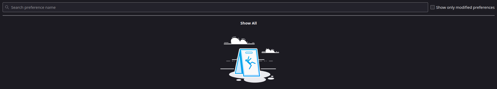
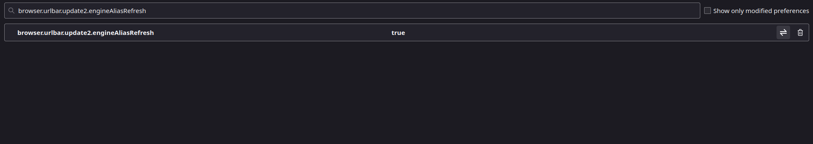
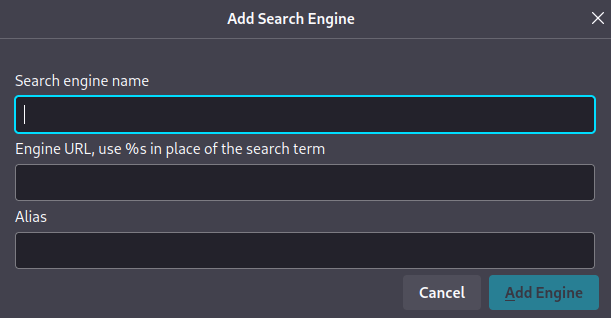
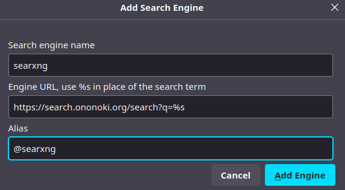

## Introduction

On Firefox for Android you can pick any default search engine you like, but the desktop version hides that option. It only lets you choose from a preset list such as `DuckDuckGo`, `Google`, and `Bing`. Here's how to add your own on desktop :)

### Modifying Firefox Configuration

These steps change Firefox's internal configuration settings. It's not hard, and the steps below walk through each part.

### Step 1: Accessing the Configuration Page

1. Open Firefox and type `about:config` in the address bar.
2. You'll see a warning message about the risks of changing advanced settings. Click on the `Accept the Risk and Continue` button to proceed.

### Step 2: Enabling Additional Search Engines

1. In the search bar at the top of the `about:config` page, enter `browser.urlbar.update2.engineAliasRefresh`.

2. Locate the preference named `browser.urlbar.update2.engineAliasRefresh` and double-click on it to toggle its value from `false` to `true`.

   

### Step 3: Adding Your Preferred Search Engine

1. Now, head back to the Firefox search settings. You'll notice a new option: `Add.` Click on this option.

   

2. Enter the details of your preferred search engine:

   - Search Engine Name: SearXNG
   - Engine URL: `https://search.ononoki.org/search?q=%s`
   - Alias: @SearXNG

3. Click `Add Engine` to save your custom search engine.

### Step 4: Set Your Custom Search Engine as Default

1. Return to the search settings and find your newly added search engine in the list.

2. Click on the three-dot menu next to your custom search engine and select `Set as Default.`

## Conclusion

I recall searching for information on how to customize the default search engine in Firefox desktop, but I struggled to find any useful resources on the topic. While there are methods that involve using extensions, I preferred not to install any additional extension for this purpose.

Eventually, I discovered a solution on Stack Overflow, and I compiled the information provided there, adding images to enhance clarity and make it easier to understand.
