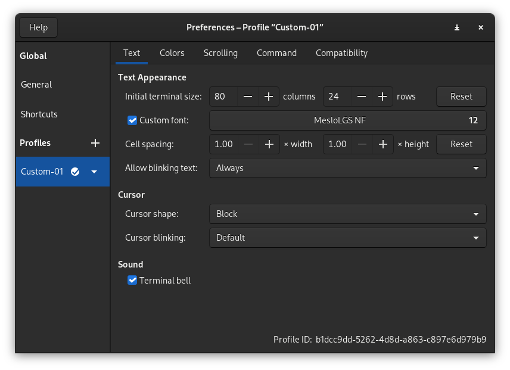

## Introduction

Tired of the same old look of your Oh My Zsh terminal? Want something more stylish and functional? Look no further than the Powerlevel10k theme, a specially designed theme for Oh My Zsh that brings beauty and functionality to your terminal.

## Getting Prepared

Before we dive into the installation of Powerlevel10k, make sure you have Oh My Zsh installed on your system. Powerlevel10k is designed as a theme for Oh My Zsh, so having Oh My Zsh is a prerequisite.

### Step 1: Installing Required Fonts

To ensure that Powerlevel10k displays correctly, it's highly recommended to install the Meslo Nerd Font. This font is officially recommended by both Oh My Zsh and Powerlevel10k for the best visual experience. Without it, some text or icons may not display correctly in your terminal.

Choose the font style that suits your preferences:

- [MesloLGS NF Regular.ttf](https://github.com/romkatv/powerlevel10k-media/raw/master/MesloLGS NF Regular.ttf)
- [MesloLGS NF Bold.ttf](https://github.com/romkatv/powerlevel10k-media/raw/master/MesloLGS NF Bold.ttf)
- [MesloLGS NF Italic.ttf](https://github.com/romkatv/powerlevel10k-media/raw/master/MesloLGS NF Italic.ttf)
- [MesloLGS NF Bold Italic.ttf](https://github.com/romkatv/powerlevel10k-media/raw/master/MesloLGS NF Bold Italic.ttf)

### Step 2: Configuring Your Terminal Fonts

Configuring fonts in your terminal depends on the terminal emulator you are using. Each terminal emulator has different options and locations for font settings. In general, you need to access your terminal's settings and select the specific font you downloaded (Meslo Nerd Font) to ensure it's displayed correctly. (As shown in the image below):



### Step 3: Installing Powerlevel10k for Oh My Zsh

Installing Powerlevel10k is a breeze, and it only requires two simple commands. Here's how you can do it:

1. Powerlevel10k provides a convenient installation script. Copy and paste the following commands into your terminal to install Powerlevel10k:

```shell
git clone --depth=1 https://github.com/romkatv/powerlevel10k.git ~/powerlevel10k
echo 'source ~/powerlevel10k/powerlevel10k.zsh-theme' >> ~/.zshrc
```

2. After executing these commands, it's time to give your terminal a quick refresh. Restart your terminal session.

3. When you launch your terminal again, you'll be greeted with the Powerlevel10k configuration wizard. This interactive wizard makes it easy to customize your Powerlevel10k theme to your liking. You can make choices by selecting options with number keys and confirming them with y/n responses.

4. Once you've completed the configuration wizard, your Powerlevel10k theme will be ready to roll!

With just a few simple steps, you'll have Powerlevel10k up and running, enhancing the look and functionality of your Oh My Zsh terminal. Enjoy your newly customized and powerful terminal experience!

## Updating Powerlevel10k

To keep your Powerlevel10k theme up to date, you can easily pull the latest updates using Git. Run the following command:

```shell
git -C ~/powerlevel10k pull
```

## Optional: Displaying Shortened Paths

If you find the display of the full path in your terminal too lengthy and prefer a shorter representation, you can configure Powerlevel10k to display only the last part of the path. Here's how:

1. Edit the `p10k.zsh` file:

```shell
vim ~/.p10k.zsh
```

2. In the Vim editor, search for the text `POWERLEVEL9K_SHORTEN_STRATEGY` by typing `/`.

3. Change the value of this parameter to `truncate_to_last`.

4. Save the changes and exit the editor.

5. Restart your terminal to see the updated path display.

With these steps, you'll have successfully enhanced your Oh My Zsh experience with the visually appealing and feature-rich Powerlevel10k theme. Enjoy your customized and powerful terminal!

## Conclusion

You've transformed your Oh My Zsh terminal into a powerful and beautifully customized environment with the Powerlevel10k theme. This elegant theme enhances the aesthetics of your terminal and provides useful features and configurations for a more efficient workflow.

By following the steps in this guide, you've achieved the following:

1. **Installed Meslo Nerd Fonts:** Ensured that your terminal can display icons and text correctly by installing the recommended Meslo Nerd Fonts.

2. **Set Up Terminal Fonts:** Configured your terminal to use the Meslo Nerd Font you installed, making sure everything looks as intended.

3. **Installed Powerlevel10k:** Installed the Powerlevel10k theme with a simple script and customized it during the setup process, tailoring it to your preferences.

4. **Optional: Shortened Path Display:** Learned how to shorten the display of the current directory in your terminal for a cleaner and more efficient prompt.

Now, your terminal not only looks great but is also a useful tool that can boost your productivity. You can use it for coding, system administration, or any other tasks with ease.

## References

- [Github: Powerlevel10k](https://github.com/romkatv/powerlevel10k)
- [zsh: Customizing Powerleve10k prompt](https://stackoverflow.com/questions/61176257/customizing-powerleve10k-prompt)
