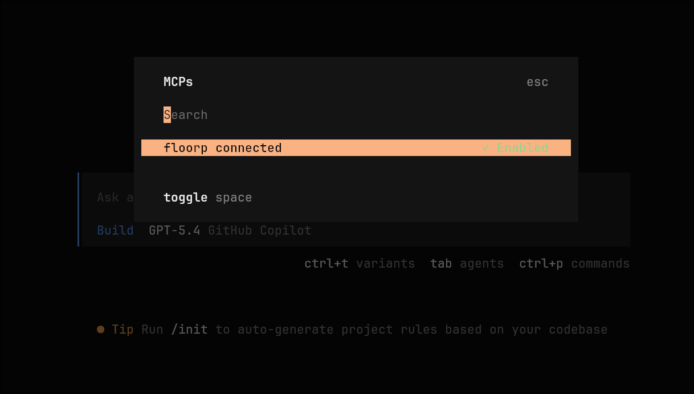

## Introduction

If you are using [OpenCode](https://opencode.ai/) and want your coding agent to interact with the [Floorp browser](https://floorp.app/), you can connect them through the `floorp-mcp-server` package.

This MCP server is from the official Floorp project and is published in the [Floorp-Projects/floorp-mcp-server](https://github.com/Floorp-Projects/floorp-mcp-server) repository.

This setup allows OpenCode to use Floorp as an MCP tool for tasks such as listing tabs, reading page content, opening new tabs, navigating pages, and performing basic browser automation.

In this guide, I will show the exact setup I used with `bunx`.

## Requirements

Before starting, make sure you have:

- [Bun](https://bun.sh/) installed
- [Floorp](https://floorp.app/) installed
- OpenCode installed and working
- Floorp running before you try to use the MCP server

You also need to enable Floorp MCP support manually.

## Enable MCP inside Floorp

Open Floorp and go to:

```text
about:config
```

Then search for:

```text
floorp.mcp.enabled
```

Set it to:

```text
true
```

Without this option enabled, OpenCode will not be able to talk to Floorp even if the MCP server is configured correctly.

## OpenCode config location

For a global user-wide setup, OpenCode reads its config from:

```text
~/.config/opencode/opencode.json
```

You can also use a project-level `opencode.json`, but for a browser MCP like this, a global config usually makes more sense.

## Add Floorp MCP server to OpenCode

Edit your OpenCode config file and add the following:

```json
{
  "$schema": "https://opencode.ai/config.json",
  "mcp": {
    "floorp": {
      "type": "local",
      "command": ["bunx", "floorp-mcp-server"],
      "enabled": true
    }
  }
}
```

### Why this config works

- `type: "local"` tells OpenCode this MCP server should be started as a local process
- `command` must be an array, not a plain string
- `bunx floorp-mcp-server` starts the published MCP package directly without a global install
- `enabled: true` makes the MCP server available when OpenCode starts

## Optional manual test

Before testing it through OpenCode, you can check whether the package starts correctly by running:

```bash
bunx floorp-mcp-server
```

If Floorp is running and MCP is enabled in `about:config`, the server should start normally.

## Restart OpenCode

After saving the config, restart OpenCode or open a new session.

Once loaded correctly, OpenCode should be able to access Floorp tools for actions such as:

- listing open tabs
- reading the current page
- opening a new tab
- navigating to another URL
- clicking elements on a page

## Use `/mcp` to list all MCP servers

If you want to quickly check whether OpenCode has loaded your MCP configuration, use the `/mcp` command inside OpenCode.

```text
/mcp
```

This lists the MCP servers available in the current session. If everything is configured correctly, you should see `floorp` in the list.

This is useful to confirm that:

- OpenCode read your config file successfully
- the MCP server is enabled
- the `floorp` MCP server is available to the current agent



## Example prompt

You can test it with a simple prompt like this:

```text
Can you see my Floorp tabs? Use floorp.
```

Or:

```text
Open a new tab in Floorp and go to https://example.com. Use floorp.
```

## Troubleshooting

If it does not work, check these items first:

- Floorp is already running
- `floorp.mcp.enabled` is set to `true`
- `bunx floorp-mcp-server` can start without errors
- your OpenCode config is saved in `~/.config/opencode/opencode.json`
- the JSON syntax is valid

## Conclusion

That is all you need to connect Floorp MCP Server to OpenCode.

Using `bunx` keeps the setup simple, and once it is configured properly, OpenCode can directly interact with your browser through Floorp's MCP bridge.
