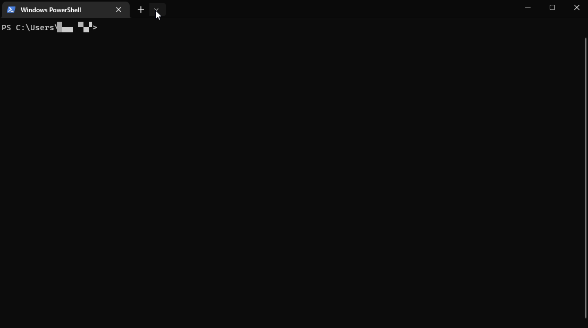
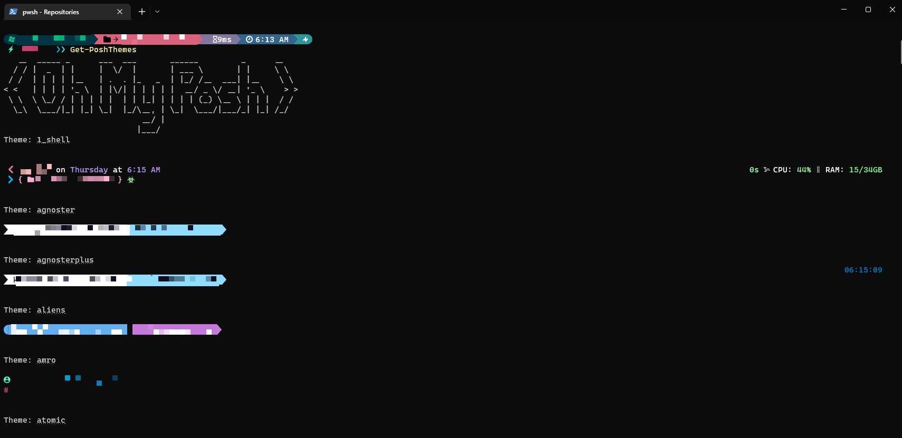
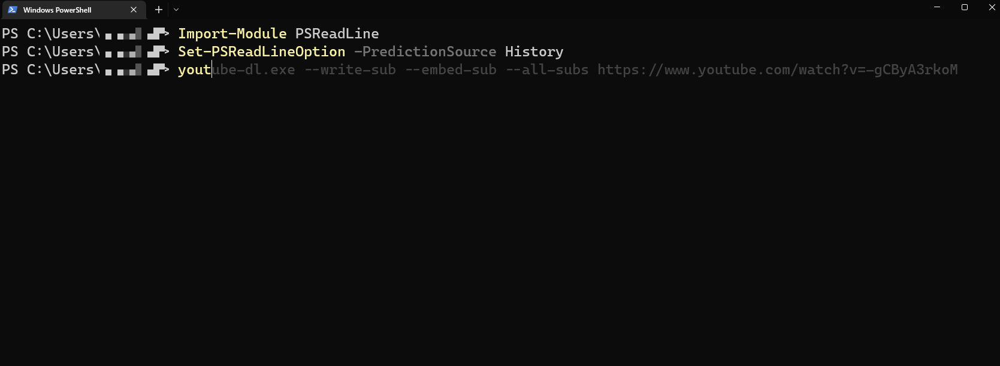
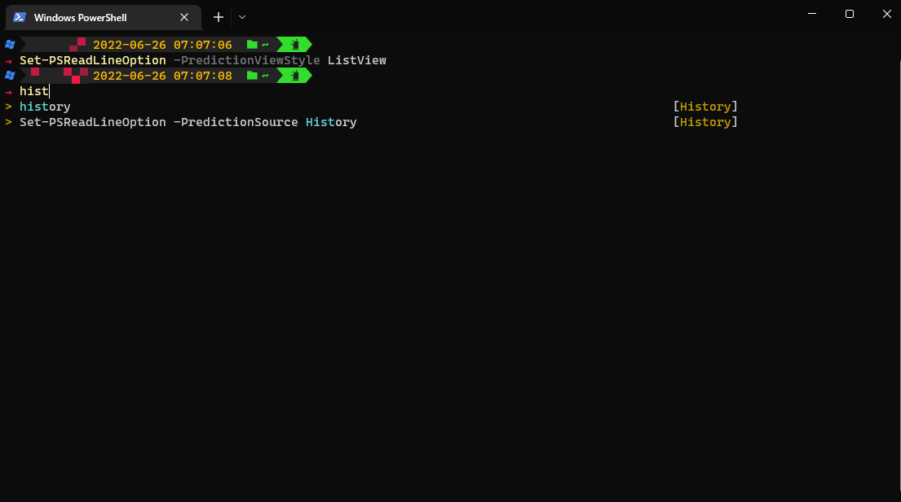

## Why Oh My Posh?

Tired of the bland default terminal prompts on Windows? Oh My Posh is a customizable prompt framework that can make your terminal look a lot better and show useful info about your environment. This guide covers installing and setting up Oh My Posh on Windows.

## What is Oh My Posh?

Oh My Posh is a prompt framework that changes how your terminal prompt looks and what it shows. You can display info like the current directory, Git branch, and more.

## Install Windows Terminal

Before we begin installing Oh My Posh, ensure that you have Windows Terminal installed on your system. You can easily find it on the Microsoft Store using the following link: [Windows Terminal on Microsoft Store](ms-windows-store://pdp/?productid=XP8K0HKJFRXGCK). Simply click the link to navigate to the store and install Windows Terminal.

## Install Oh My Posh

Installing Oh My Posh on your Windows system is straightforward, and you have multiple options to choose from. Whether you prefer package managers or manual installation. Here are three methods:

### Method 1: Using `winget`

For using `winget` (Windows Package Manager) install Oh My Posh, using the following command:

```powershell
winget install JanDeDobbeleer.OhMyPosh -s winget
```

### Method 2: Using `scoop`

For those who rely on `scoop` (the Windows command-line installer), installing Oh My Posh is as simple as running this command:

```powershell
scoop install https://github.com/JanDeDobbeleer/oh-my-posh/releases/latest/download/oh-my-posh.json
```

### Method 3: `Manual` Installation

If you prefer manual installation, follow these steps:

1. Open your PowerShell terminal as an administrator.

2. Run the following command to set the execution policy and bypass any restrictions:

```powershell
Set-ExecutionPolicy Bypass -Scope Process -Force;
```

3. Next, execute the following command to download and install Oh My Posh:

```powershell
Invoke-Expression ((New-Object System.Net.WebClient).DownloadString('https://ohmyposh.dev/install.ps1'))
```

Oh My Posh is now installed on your Windows system.

## Understanding Nerd Fonts

Nerd Fonts are specialized fonts that have been patched to include a wide range of icons and symbols. These fonts are essential for Oh My Posh to display icons associated with themes and prompts correctly.

> Notes: While various Nerd Fonts are compatible with Oh My Posh,In the official website, the developer recommends that you use the [Meslo LGM NF](https://github.com/ryanoasis/nerd-fonts/releases/download/v3.0.2/Meslo.zip) for the best experience.

### Installing Fonts for Oh My Posh

When it comes to personalizing your terminal experience with Oh My Posh, fonts play a crucial role. Nerd Fonts are fonts patched with a wide range of icons, which Oh My Posh needs to display theme icons. Here's how to install them.

#### Way1: Using Oh My Posh's CLI for Font Installation

Oh My Posh simplifies the process of installing Nerd Fonts with its built-in CLI (Command Line Interface). Follow these steps to install a Nerd Font using the CLI:

1. Open your terminal as an administrator for system-wide font installation. Alternatively, if you lack admin rights, you can use the `--user` flag, keeping in mind that this may have certain side effects with specific applications.

2. Execute the following command to start the font installation process:

```powershell
oh-my-posh font install
```

#### Way2: Manual Installation of Nerd Fonts

Alternatively, you can manually install Nerd Fonts:

1. Visit the Nerd Fonts website at [www.nerdfonts.com](https://www.nerdfonts.com/font-downloads).

2. Download the zip archive containing your preferred Nerd Font.

3. Extract the contents of the zip archive.

4. Right-click on each font file and select "Install" to install the fonts on your system.

#### Adjusting Terminal Font Settings

To fully benefit from the installed Nerd Fonts, you might need to configure your terminal to use them. Here's how you can do it:

1. Open your terminal.

2. Access the terminal's settings or preferences menu. This can typically be found in the menu bar.

3. Navigate to the "Presets," "Profiles," or "Appearance" section.

4. Look for the font settings and select the Nerd Font you installed. Adjust the font size if needed.

##### Visual Guide

For a visual walkthrough of the font installation process, refer to the following animated guide:



## Browsing and Selecting Themes

To discover the available themes, you can visit the official Oh My Posh themes documentation [here](https://ohmyposh.dev/docs/themes). You'll find a collection of themes, each giving your terminal prompt a different look.

### Listing Available Themes

1. **Discover Themes**: Browse the available themes on the official Oh My Posh themes documentation.

2. **Command-Line Discovery**: Alternatively, you can use the command line to list all the available themes. Open your terminal and execute the following command:

```powershell
Get-PoshThemes
```



### Previewing Themes

Before applying a theme, it's a good idea to preview how it will look on your terminal. You can use the following command to see how a specific theme would appear:

```powershell
oh-my-posh init pwsh --config $env:POSH_THEMES_PATH\<theme_name>.omp.json | Invoke-Expression
```

Replace <theme_name> with the actual name of the theme you're interested in.

This command gives you a real-time preview of how the selected theme will affect your terminal prompt. It's a convenient way to try out different themes before picking one.

### Applying the Themes

Once you've found a theme you like, follow these steps to apply it:

1. **Open Your Terminal**: Launch your terminal application to begin the customization process.

2. **Create a Profile Script**: If you don't have a profile script already, you'll need to create one. The profile script controls the configuration settings for your terminal. Use the following command to create a new profile script:

   ```powershell
   New-Item -Path $PROFILE -Type File -Force
   ```

   This command will create a new profile script in the specified path.

3. **Access Theme Configuration**: To edit the `$PROFILE` script, you can use the Notepad text editor. Open Notepad and then open the `$PROFILE` script using the command:

   ```powershell
   notepad $PROFILE
   ```

   The path to the `$PROFILE` script is typically:

   ```plain
   C:\Users\<Your_Username>\Documents\WindowsPowerShell\Microsoft.PowerShell_profile.ps1
   ```

4. **Selecting a Theme**:

   a. **Option 1 - Set-PoshPrompt**:
   Locate the line that sets the theme using the `Set-PoshPrompt` command. Modify this line to reflect the name of the theme you want to use. For example:

   ```powershell
   Set-PoshPrompt -Theme theme_name
   ```

   Replace `theme_name` with the actual name of the theme you selected.

   b. **Option 2 - oh-my-posh init**:
   Alternatively, you can use the following command to select a theme and apply it directly to your current terminal session:

   ```powershell
   oh-my-posh init pwsh --config $env:POSH_THEMES_PATH\<theme_name>.omp.json | Invoke-Expression
   ```

   Replace `theme_name` with the actual name of the theme you selected.

5. **Save and Apply Changes**: Save the changes to the `$PROFILE` script in Notepad and close the editor. Restart your terminal to see the new theme.

## Optional: Installing and Inserting Required Modules

These optional modules add features like command history, Git info, and file icons.

>Notes: Before you proceed, please open PowerShell as an <code>Administrator</code>.

### Install PSReadLine Module

The `PSReadLine` module is essential for displaying the commands you've entered before, making it convenient for you to re-enter commands.

```powershell
Install-Module PSReadLine -Force
```

### Install posh-git Module

The `posh-git` module is used to display Git information from your current repository (if you're in a Git repository).

```powershell
Install-Module posh-git -Force
```

### Install Terminal-icons Module

The `Terminal-icons` module shows icons for your files and folders in the command console.

```powershell
Install-Module Terminal-icons -Force
```

## Importing Modules into PowerShell

After installing the modules, you need to import them into PowerShell to use their functions. Here's how to import each one:

### Inserting Terminal-icons Module

The `Terminal-icons` module shows icons for files and folders. To import this module, follow these steps:

1. Launch PowerShell.

2. Enter the following command:

   ```powershell
   Import-Module Terminal-icons
   ```

   This will load the `Terminal-icons` module into your PowerShell session.

### Inserting posh-git Module

The `posh-git` module displays Git-related information, such as the current branch name in your repository. To import this module:

1. Launch PowerShell.

2. Enter the following command:

   ```powershell
   Import-Module posh-git
   ```

   This command will load the `posh-git` module, enabling its features in your terminal.

### Inserting PSReadLine Module

The `PSReadLine` module improves command history with several modes. To import this module, follow these steps:

1. Launch PowerShell.

2. Enter the following command:

   ```powershell
   Import-Module PSReadLine
   ```

   This loads the `PSReadLine` module.

#### PSReadLine Modes for Command History

PSReadLine offers different prediction modes for command history. Here's how to use them:

#### PSReadLine Mode: History

This mode mimics the behavior seen on most Linux systems and is a favorite among many users. To enable this mode, use the following command:

> **Note**: In this mode, if the text you're about to enter matches previous text, a gray prompt displays the matching text.

```powershell
Set-PSReadLineOption -PredictionSource History
```



#### PSReadLine Mode: ListView

The ListView mode presents a list of all commands related to the text you've typed, offering easy command selection. Use the arrow keys (↑ ↓ ← →) to navigate the list, and press Enter to execute the selected command.

>**Tip**: Utilize the arrow keys to navigate and press Enter to execute the selected command.

To activate the ListView mode, execute the following command:

```powershell
Set-PSReadLineOption -PredictionViewStyle ListView
```



Try both modes to see which one you prefer.

## Configuring Persistent Modifications in Your PowerShell Profile

While the changes you've made so far are valuable, they only apply to the current terminal window. If you close the window, these modifications will be lost. To ensure that your enhancements remain in effect every time you launch PowerShell, you'll need to make adjustments to your PowerShell profile.

### Opening with Notepad

1. using Notepad to edit files, you can initiate the editing process with the following PowerShell command:

```powershell
notepad $PROFILE
```

#### Modifying the Profile File

2. Once the profile file is open in your preferred text editor, insert the following lines of code:

```powershell
Import-Module Terminal-icons
Import-Module posh-git

Set-PSReadLineOption -PredictionSource History

oh-my-posh init pwsh --config $env:POSH_THEMES_PATH\microverse-power.omp.json | Invoke-Expression
```

3. Save the changes you've made to the profile file and then close the text editor.

By appending these lines to your PowerShell profile, the modules load and the settings apply every time you start PowerShell.

## Article Usage Directives

To facilitate your interaction with this article, here is a concise list of the PowerShell commands and instructions that have been discussed:

1. Installing Oh My Posh using Winget:
   ```powershell
   winget install JanDeDobbeleer.OhMyPosh -s winget
   ```

2. Installing Oh My Posh using Scoop:
   ```powershell
   scoop install https://github.com/JanDeDobbeleer/oh-my-posh/releases/latest/download/oh-my-posh.json
   ```

3. Installing Oh My Posh manually:
   ```powershell
   Set-ExecutionPolicy Bypass -Scope Process -Force; Invoke-Expression ((New-Object System.Net.WebClient).DownloadString('https://ohmyposh.dev/install.ps1'))
   ```

4. Installing the PSReadLine Module:
   ```powershell
   Install-Module PSReadLine-Force
   ```

5. Installing the posh-git Module:
   ```powershell
   Install-Module posh-git-Force
   ```

6. Installing the Terminal-icons Module:
   ```powershell
   Install-Module Terminal-icons -Force
   ```

7. Importing the Terminal-icons Module:
   ```powershell
   Import-Module Terminal-icons
   ```

8. Importing the posh-git Module:
   ```powershell
   Import-Module posh-git
   ```

9. Importing the PSReadLine Module:
   ```powershell
   Import-Module PSReadLine
   ```

10. Setting PSReadLine mode to History:
    ```powershell
    Set-PSReadLineOption -PredictionSource History
    ```

11. Setting PSReadLine mode to ListView:
    ```powershell
    Set-PSReadLineOption -PredictionViewStyle ListView
    ```

12. Displaying Available Oh My Posh Themes:
    ```powershell
    Get-PoshThemes
    ```

14. Initializing Oh My Posh with a Chosen Theme:
    ```powershell
    oh-my-posh init pwsh --config $env:POSH_THEMES_PATH\microverse-power.omp.json | Invoke-Expression
    ```

15. Opening Your PowerShell Profile with Notepad:
    ```powershell
    notepad $PROFILE
    ```

## Conclusion

In this guide, we've covered how to customize your Windows terminal with Oh My Posh. Here's a summary of what we've covered:

1. **Installation and Setup**: We began by installing Oh My Posh using different methods, such as Winget, Scoop, and manual installation. We also emphasized the importance of using Nerd Fonts for optimal display.

2. **Theme Selection**: We introduced you to the wide variety of themes available for Oh My Posh and demonstrated how to preview and choose a theme that suits your style.

3. **Module Installation**: We explored the installation of essential modules: PSReadLine, posh-git, and Terminal-icons. These modules add command history, Git information, and file and folder icons.

4. **Module Integration**: We explained how to integrate the installed modules into your PowerShell profile. This ensures that the modules are loaded automatically whenever you start PowerShell.

5. **PSReadLine Modes**: We covered different PSReadLine modes: History and ListView, which help with command prediction and navigation within your terminal.

6. **Profile Customization**: We guided you through locating and modifying your PowerShell profile file. By adding specific commands to your profile, you can ensure that your chosen themes and modules are loaded each time you launch PowerShell.

With this setup, you can experiment with themes, explore more modules, and tweak your settings until you find the terminal setup that works for you.

## References

- https://ohmyposh.dev/docs/
- https://www.kwchang0831.dev/dev-env/pwsh/oh-my-posh
