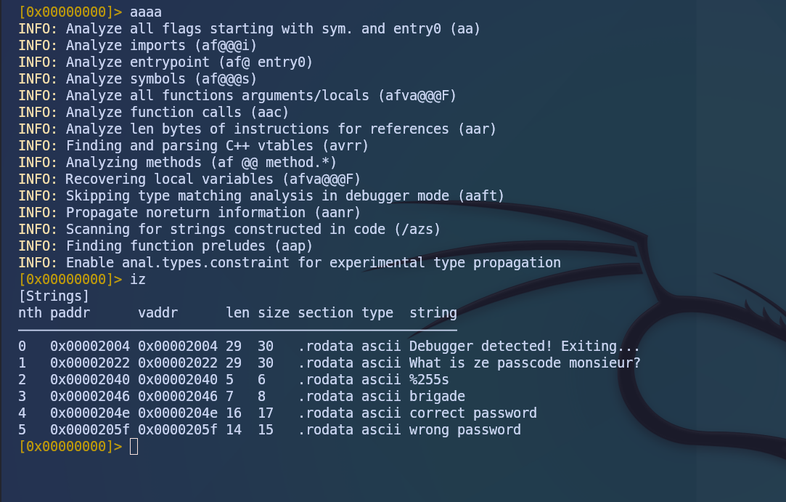
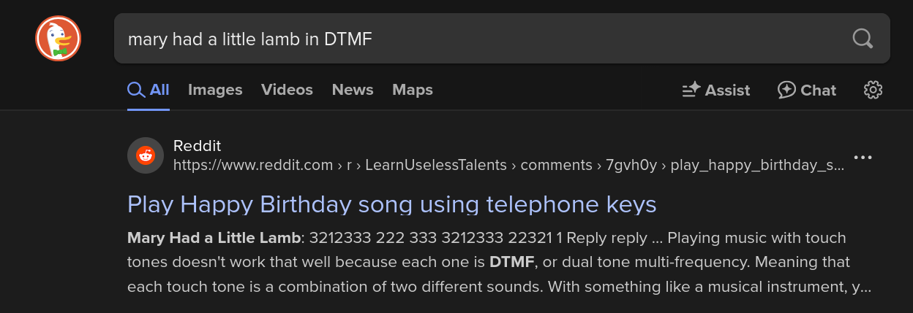

# Introduction

Bronco CTF 2025 began on Sunday, February 16, 2025, at 3:00 AM and concluded on Monday, February 17, 2025, at 3:00 AM. The event was organized by the Santa Clara University Cybersecurity Club. Fortunately, the timing of the event worked well for me, as I tend to stay up late. I spent about 10 hours solving challenges and managed to complete around 4 of them. This competition was quite guess-based and non-technical, so I ended up skipping several challenges.

> Event Website: [Bronco CTF](https://ctfd.broncoctf.xyz/)

## Delayed Announcement

Bronco CTF 2025 experienced an unexpected delay due to server issues caused by a high volume of participants trying to access the site. As a result, the competition was postponed for about 6 hours. The organizers provided a Google Drive link to download the challenges, allowing us to work on them while the server was down. Once the server was back up, we could submit our flags through the platform.

## Break the Battalion

This challenge involved simple reverse engineering. We were given a binary file `a.out` and tasked with finding the flag within it.

### Solution

Upon examining the file, I identified it as a `.out` file, which indicated it was compiled with g++ or gcc. I opened it to see what it does.

```bash
┌──(leon㉿localhost)-
└─$ ./a.out
What is ze passcode monsieur?
232
bcb
wrong password
```

It appeared to be a password-protected file, and I needed to discover the actual password to retrieve the flag. After some guessing, I decided to use `strings` to analyze the binary file.

```bash
┌──(leon㉿localhost)-
└─$ strings a.out
...
Debugger detected! Exiting...
What is ze passcode monsieur?
%255s
brigade
correct password
wrong password
;*3$"
GCC: (GNU) 14.2.1 20240910
new.c
...
```

From the `strings` output, I could see that it was a GCC-compiled file, with the original file name being `new.c`. The password input was identified as `brigade`. This was enough information to retrieve the flag, but I decided to analyze the file further using radare2.

Using radare2, I disassembled the binary to find the flag.

```bash
┌──(leon㉿localhost)
└─$ r2 a.out
WARN: Relocs has not been applied. Please use `-e bin.relocs.apply=true` or `-e bin.cache=true` next time
[0x000010b0]> iz
[Strings]
nth paddr      vaddr      len size section type  string
――――――――――――――――――――――――――――――――――――――――――――――――――――――――――――――――――――――――――――――――――――
0   0x00002004 0x00002004 29  30   .rodata ascii Debugger detected! Exiting...
1   0x00002022 0x00002022 29  30   .rodata ascii What is ze passcode monsieur?
2   0x00002040 0x00002040 5   6    .rodata ascii %255s
3   0x00002046 0x00002046 7   8    .rodata ascii brigade
4   0x0000204e 0x0000204e 16  17   .rodata ascii correct password
5   0x0000205f 0x0000205f 14  15   .rodata ascii wrong password
```

I confirmed that `brigade` was indeed the password, so I tried it.

```bash
┌──(leon㉿localhost)-
└─$ ./a.out
What is ze passcode monsieur?
brigade
2"97145
wrong password
```

This time, I received an interesting hint: `2"97145`. I decided to try this input.

```bash
┌──(leon㉿localhost)-
└─$ ./a.out
What is ze passcode monsieur?
2"97145
brigade
correct password
```

This time, I received the output `correct password`, and the flag was `bronco{brigade}`.



## Inspector Requestor

For this challenge, we were given a link to a Google Form, but it said, `unfortunately, it was too late for us to retrieve the flag. It felt like a trick.`

### Solution

The solution was straightforward: I simply browsed the source code of the page, and there it was—the flag.

```
Since you are here, here is the flag! Inspect element is fun.
bronco{why_does_google_still_expos3_th1s_wh3n_i_stopped_accepting_submissions_101}
```

The flag is `bronco{why_does_google_still_expos3_th1s_wh3n_i_stopped_accepting_submissions_101}`.

## Mary's Lamb is a Little Phreak

This challenge was quite guess-based. We were given a link to input some text, and we had to guess the flag. No technical skills were required for this challenge.

### Solution

I searched through a search engine using the phrase `mary had a little lamb in DTMF`, and the first website that appeared in the results contained the flag.

and the flat is `bronco{32123332223333212333223211}`



## Rahhh-Sh

This challenge was a cryptography task where we had to decrypt the given text to obtain the flag.

### Solution

I used Python to decrypt the message.

```python
import math

e = 65537
p = -811
n = 3429719

q = n // p

phi_n = (p + 1) * (q + 1)

def extendedEuclideanAlgo(e, phi_n):
    A1, A2, A3 = 1, 0, phi_n
    B1, B2, B3 = 0, 1, e

    while True:
        if B3 == 0:
            return -1
        if B3 == 1:
            return B2

        Q = A3 // B3
        T1, T2, T3 = A1 - (Q * B1), A2 - (Q * B2), A3 - (Q * B3)
        A1, A2, A3 = B1, B2, B3
        B1, B2, B3 = T1, T2, T3

d = extendedEuclideanAlgo(e, phi_n)

def decrypt(c, d, n):
    return [pow(ci, d, n) for ci in c]

c = [-53102, -3390264, -2864697, -3111409, -2002688, -2864697, -1695722, -1957072, -1821648, -1268305, -3362005, -712024, -1957072, -1821648, -1268305, -732380, -2002688, -967579, -271768, -3390264, -712024, -1821648, -3069724, -732380, -892709, -271768, -732380, -2062187, -271768, -292609, -1599740, -732380, -1268305, -712024, -271768, -1957072, -1821648, -3418677, -732380, -2002688, -1821648, -3069724, -271768, -3390264, -1847282, -2267004, -3362005, -1764589, -293906, -1607693]

decrypted_message = decrypt(c, d, n)

flag = ''.join(chr(m) for m in decrypted_message if 0 <= m < 256)
print("Decrypted Message:", decrypted_message)
print("Flag:", flag)
```

flag: `bronco{m4th3m4t1c5_r34l1y_1s_qu1t3_m4g1c4l_raAhH!}`.

## Conclusion

Overall, Bronco CTF 2025 was too guess-based, Personally, I prefer technical challenges. but unfortunately, almost all the challenges were guess-based. I hope the next CTF will be more technical and challenging.
