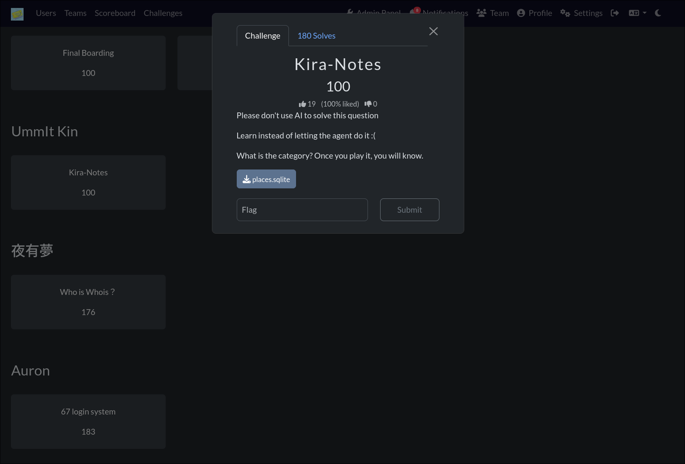
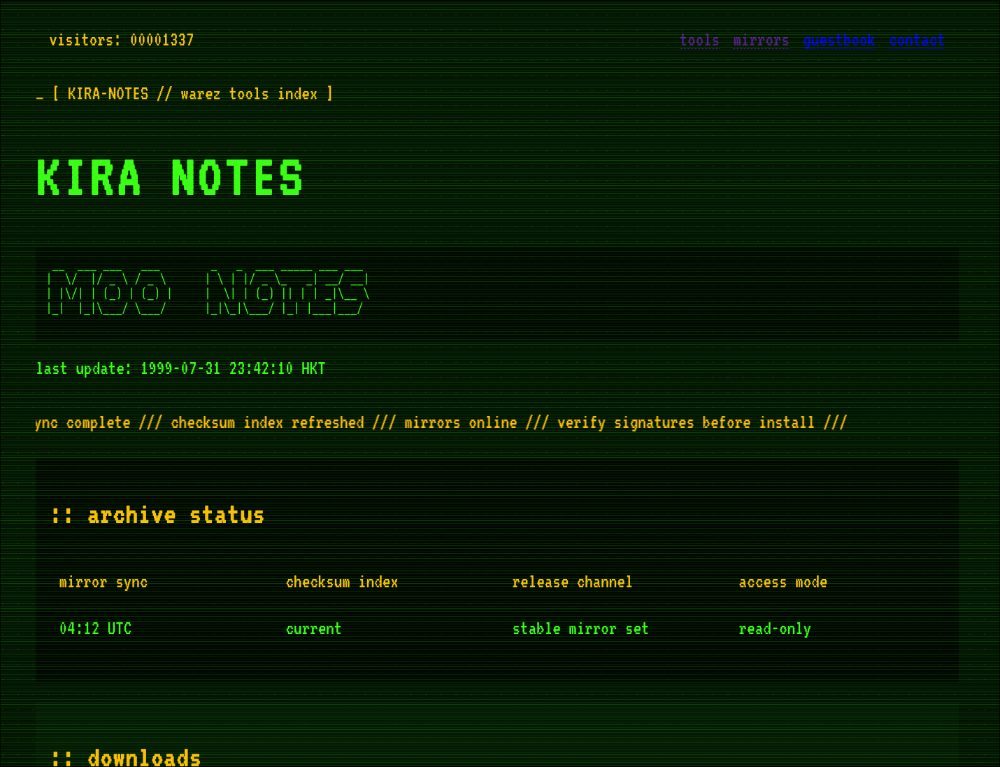
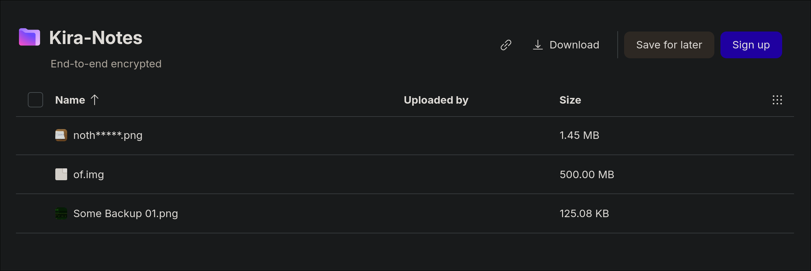
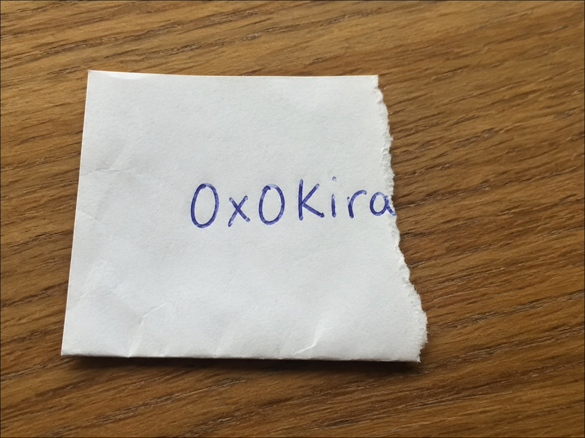
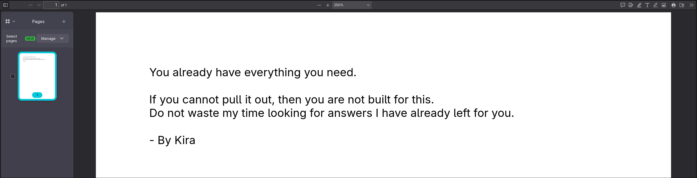

>WriteUP updated for NHNC 2026. Kira-Notes computer forensics challenge. One SQLite file. One disk image. One encrypted archive. Good luck.

# Introduction

This is my complete writeup for the No Hack No CTF 2026 challenges, focusing on the Kira-Notes computer forensics challenge that I created.

This challenge simulates a real digital forensics investigation. starting from a single browser history database, tracing leads to a cloud drive, downloading evidence, recovering deleted data from a disk image, and cracking an encrypted archive.

## Kira-Notes Challenge

### Background Story

You want to join a notorious hacker group. Their leader sends you a single file: `places.sqlite`. One file. One chance.

"Prove yourself," the message says. "The truth is buried inside. Find it, or don't bother coming back."

You start digging. The browser history leads you to a retro hacker website called Kira-Notes. a decoy storefront for stolen tools and dead links. Then to a Proton Drive share. Then to a disk image that looks empty at first glance.

But this group doesn't recruit people who stop at first glance. They recruit people who dig. Who carve. Who recover what was deleted.

The question is: are you one of them?

### Challenge Overview

The challenge provides a single file: `places.sqlite`.

No disk image. No memory dump. No network capture. Just one Firefox browser history database.

Everything else you must find yourself.



### Step 1 — Understanding What You Have

`places.sqlite` is Firefox's browser history database. First, confirm the file type:

```bash
file places.sqlite
```

Output:

```
places.sqlite: SQLite 3.x database, user version 86 (0x56), last written using SQLite version 3051003, page size 32768, writer version 2, read version 2, file counter 140, database pages 114, 1st free page 106, free pages 61, cookie 0x2f, schema 4, UTF-8, version-valid-for 140
```

It's a valid SQLite3 database. Open it:

```bash
sqlite3 places.sqlite ".tables"
```

Output:

```
moz_anno_attributes       moz_historyvisits           moz_keywords               moz_newtab_story_impression     moz_places_metadata
moz_annos                 moz_historyvisits_extra     moz_meta                   moz_origins                     moz_places_metadata_search_queries
moz_bookmarks             moz_inputhistory            moz_newtab_shortcuts_...   moz_places                      moz_previews_tombstones
moz_bookmarks_deleted     moz_items_annos             moz_newtab_story_click     moz_places_extra
```

### Step 2 — Extracting Browser History

Query the browsing history with timestamps:

```bash
sqlite3 places.sqlite \
  "SELECT datetime(moz_historyvisits.visit_date/1000000,'unixepoch','localtime') as visit_time,
          moz_places.url,
          moz_places.title
   FROM moz_historyvisits
   JOIN moz_places ON moz_places.id = moz_historyvisits.place_id
   ORDER BY moz_historyvisits.visit_date DESC;"
```

Key entries from the output:

| visit_time | url | title |
|---|---|---|
| 2026-07-04 01:54:58 | `http://151.158.224.74:31337/dl/notebook-crack.tgz` | 404 Not Found |
| 2026-07-04 01:54:44 | `http://151.158.224.74:31337/dl/eyeswap.bin` | 404 Not Found |
| 2026-07-04 01:54:42 | `http://151.158.224.74:31337/#guestbook` | Kira Notes // Retro Hacker Archive |
| 2026-07-04 01:54:34 | `http://151.158.224.74:31337/wtfbro` | 404 Not Found |
| 2026-07-04 01:54:10 | `http://151.158.224.74:31337/` | Kira Notes // Retro Hacker Archive |
| 2026-07-04 00:20:12 | `https://drive.proton.me/urls/00MNVW0SHG#do4wWWpAQ0Lw` | Kira-Notes - Proton Drive |
| 2026-07-03 14:43:25 | `https://drive.proton.me/urls/00MNVW0SHG#do4wWWpAQ0Lw` | Kira-Notes - Proton Drive |
| 2026-07-03 13:56:28 | `https://proton.me/` | Proton: Privacy by default |
| 2026-07-01 21:23:25 | `https://github.com/UmmItKin/Kira-Notes` | GitHub - UmmItKin/Kira-Notes |
| 2026-07-01 21:23:17 | `https://github.com/orgs/ICEDTEACTF/repositories` | ICEDTEACTF repositories |
| 2026-07-01 18:37:38 | `https://www.google.com/search?q=Github.com/UmmItKin` | Github.com/UmmItKin - Google Search |

### Step 3 — Following the Trail

Analyzing the browser history reveals two key leads:

**Lead 1 — The VPS Server (`151.158.224.74:31337`)**

The suspect visited a server running on port 31337 multiple times. The page title reveals it's "Kira Notes // Retro Hacker Archive". A retro hacker-themed website. They tried downloading several files (`/dl/notebook-crack.tgz`, `/dl/eyeswap.bin`). all returning 404. They also visited `/guestbook` and tried `/wtfbro`. This server hosts the Kira-Notes frontend that matches the GitHub repository.



**Lead 2 — The Proton Drive Share**

The suspect visited `https://drive.proton.me/urls/00MNVW0SHG#do4wWWpAQ0Lw` twice. The page title is "Kira-Notes - Proton Drive". This Proton Drive share link is the critical lead. Follow it.



**Lead 3 — GitHub Activity**

The suspect browsed `UmmItKin/Kira-Notes` on GitHub, searched Google for `Github.com/UmmItKin`, and also visited the `ICEDTEACTF` organization. These establish the suspect's identity and technical interests.

### Step 4 — Downloading from Proton Drive

Visit the Proton Drive share link. It contains three files:

1. `of.img` — a raw disk image
2. `noth_____.png` — an incomplete handwritten note

Download both.

### Step 5 — Analyzing the Incomplete Image

`noth_____.png` is a partial image. A handwritten note with a password on it, but the image is incomplete. You can see part of a password, but crucial segments are missing. This is a split-password puzzle. You have half the answer.



To get the full password, you must recover the complete image from the disk image.

### Step 6 — Mounting `of.img`. First Look

Before jumping into forensics tools, do a basic mount and see what's visible on the filesystem.

**Method 1. One-line offset mount**

```bash
sudo mount -o loop,offset=$((2048*512)) of.img /tmp/kira
```

**Method 2. Loop device with partition scan**

```bash
sudo losetup -fP --show of.img
# output: /dev/loop0
sudo mount /dev/loop0p1 /tmp/kira
```

Now explore the mounted filesystem:

```bash
ls -laR /tmp/kira
```

Output:

```
/tmp/kira:
total 20
drwxr-xr-x 4 root root  4096 Jul  4 01:00 .
drwxr-xr-x 1 root root    20 Jul  5 19:00 ..
drwxr-xr-x 3 root root  4096 Jul  4 01:00 home
drwx------ 2 root root 16384 Jul  4 00:24 lost+found

/tmp/kira/home:
total 4
drwxr-xr-x 3 root root 4096 Jul  4 01:00 .
drwxr-xr-x 4 root root 4096 Jul  4 01:00 ..
drwxr-xr-x 3 root root 4096 Jul  4 01:00 ctf

/tmp/kira/home/ctf:
total 4
drwxr-xr-x 3 root root 4096 Jul  4 01:00 .
drwxr-xr-x 3 root root 4096 Jul  4 01:00 ..
drwxr-xr-x 2 root root 4096 Jul  4 01:00 Downloads

/tmp/kira/home/ctf/Downloads:
total 24
drwxr-xr-x 2 root root 4096 Jul  4 01:00 .
drwxr-xr-x 3 root root 4096 Jul  4 01:00 ..
-rw-r--r-- 1 root root    1 Jul  4 01:00 I
-rw-r--r-- 1 root root    4 Jul  4 01:00 will
-rw-r--r-- 1 root root    3 Jul  4 01:00 not
-rw-r--r-- 1 root root    3 Jul  4 01:00 let
-rw-r--r-- 1 root root    3 Jul  4 01:00 you
-rw-r--r-- 1 root root    3 Jul  4 01:00 see
-rw-r--r-- 1 root root    2 Jul  4 01:00 it
```

The visible files in `Downloads/` spell out a message: **"I will not let you see it"**. Each word is a separate file. This looks like a taunt. but there's nothing useful here.

At first glance, the disk image appears to contain nothing but this decoy message. Time to look deeper.

```bash
sudo umount /tmp/kira
sudo losetup -D
```

### Step 7 — Real Forensics on `of.img`

The `of.img` is a raw GPT-partitioned disk image. Start by inspecting its partition structure:

```bash
mmls of.img
```

Output:

```
GUID Partition Table (EFI)
Offset Sector: 0
Units are in 512-byte sectors

      Slot      Start        End          Length       Description
000:  Meta      0000000000   0000000000   0000000001   Safety Table
001:  -------   0000000000   0000002047   0000002048   Unallocated
002:  Meta      0000000001   0000000001   0000000001   GPT Header
003:  Meta      0000000002   0000000033   0000000032   Partition Table
004:  000       0000002048   0001021951   0001019904   primary
005:  -------   0001021952   0001023999   0000002048   Unallocated
```

The primary partition starts at sector 2048 (512-byte sectors).

### Step 8 — `fls`. The Real Filesystem View

List the filesystem contents:

```bash
fls -r -o 2048 of.img
```

Output:

```
d/d 64769:	home
+ d/d 64770:	ctf
++ d/d 64771:	Downloads
+++ r/r 64772:	I
+++ r/r 64773:	will
+++ r/r 64774:	not
+++ r/r 64775:	let
+++ r/r 64776:	you
+++ r/r 64777:	see
+++ r/r 64778:	it
d/d 11:	lost+found
V/V 127513:	$OrphanFiles
+ -/r * 64779:	OrphanFile-64779
+ -/r * 64780:	OrphanFile-64780
+ -/r * 64781:	OrphanFile-64781
```

The visible files in `Downloads/` spell out a decoy message: **"I / will / not / let / you / see / it"**. Each word is a separate file. This is a red herring meant to taunt and distract you.

But look closer. At the bottom, there are **orphan files**. Entries marked with `*`, indicating deleted inodes at 64779, 64780, and 64781. The files were removed from the filesystem, but their data blocks still exist on disk.

### Step 9 — Recovering Everything with `foremost`

The real evidence is in unallocated space and deleted file blocks. Use `foremost` without any file type filter. It will detect and recover everything:

```bash
foremost of.img -o /tmp/recover
```

Output during carving:

```
Processing: of.img
|**foundat=flag.txt� ***|
```

No `-t` flag needed. `foremost` scans the entire disk image and carves files by their header/footer signatures automatically.

Explore the recovered output:

```bash
tree -r /tmp/recover
```

```
.
├── zip
│   └── 00543746.zip
├── png
│   └── 00543748.png
├── pdf
│   └── 01019906.pdf
└── audit.txt

4 directories, 4 files
```

`foremost` recovered three files across three categories:

- **zip/** : `00543746.zip` (256 B). The encrypted archive containing the flag
- **png/** : `00543748.png` (1 MB, 1208x843). The **complete handwritten password image**
- **pdf/** : `01019906.pdf` (12 KB). The challenge message

### Step 10 — The `foremost` Audit Report

`foremost` also generates `audit.txt` with detailed recovery metadata:

```
Foremost version 1.5.7 by Jesse Kornblum, Kris Kendall, and Nick Mikus
Audit File

Foremost started at Sun Jul  5 18:58:52 2026
Invocation: foremost of.img -o /tmp/recover
Output directory: /tmp/recover
Configuration file: /etc/foremost.conf
------------------------------------------------------------------
File: of.img
Start: Sun Jul  5 18:58:52 2026
Length: 500 MB (524288000 bytes)

Num  Name (bs=512)        Size      File Offset   Comment

0:   00543746.zip          256 B    278397952
1:   00543748.png           1 MB    278398976     (1208 x 843)
2:   01019906.pdf          12 KB    522191872
Finish: Sun Jul  5 18:58:58 2026

3 FILES EXTRACTED

zip:= 1
png:= 1
pdf:= 1
------------------------------------------------------------------

Foremost finished at Sun Jul  5 18:58:58 2026
```

### Step 11 — Examining the Recovered Files

**The Complete Password Image**

The recovered PNG is the full, undamaged version of the handwritten password note. Unlike the incomplete `noth_____.png` from Proton Drive, this version shows the **entire password** clearly. No missing segments, no corruption.


Now you have the full password. The partial image from Proton Drive was just one half of the puzzle.

**The Challenge Message**

The recovered PDF contains the message the hacker group leader left behind. It was embedded in the disk image, deleted to test your skills, and now recovered via `foremost`.

This is the message the group wanted you to find. The one that separates those who just mount a disk from those who truly investigate. The one buried under decoy files and orphan inodes.



You've proven yourself. The password on the recovered note is your final key.

### Step 12 — Decrypting the Archive

Use the password from the recovered complete PNG to decrypt `final.zip`:

```bash
7z x -p0x0kira1337 /tmp/recover/zip/00543746.zip
```

### Step 13 — The Flag

```bash
cat flag.txt
```

> `flag{n0w_y0u_kn0w_h0w_t0_f0r3ns1c_f1r3f0x}`

---

## Challenge Summary

### Complete Attack Chain

```
places.sqlite (Firefox browser history)
  └── sqlite3 query → moz_historyvisits + moz_places
       ├── VPS: 151.158.224.74:31337 (Kira Notes retro hacker site)
       └── Proton Drive share: drive.proton.me/urls/00MNVW0SHG
            ├── Download: of.img (disk image)
            ├── Download: noth_____.png (partial handwritten password)
            │
            └── of.img → Disk Forensics
                 ├── Basic mount → decoy: "I will not let you see it"
                 ├── Unmount. Dig deeper
                 ├── mmls → GPT partition at sector 2048
                 ├── fls -r -o 2048 → orphan files at inode 64779-64781
                 └── foremost of.img → carves everything
                      ├── png/ → 00543748.png → COMPLETE password image
                      ├── pdf/ → 01019906.pdf → challenge message
                      └── zip/ → 00543746.zip → final.zip
                           └── Decrypt with recovered password
                                └── flag.txt → flag{n0w_y0u_kn0w_h0w_t0_f0r3ns1c_f1r3f0x}
```

### Tools Used

| Tool | Purpose |
|------|---------|
| `sqlite3` | Query Firefox `places.sqlite` browser history |
| `sqlitebrowser` | GUI alternative for browsing SQLite |
| `mmls` | Display GPT partition layout |
| `fls -r` | Recursively list files, including deleted entries |
| `foremost` | File carving. recover all file types from disk image |
| `7z` | Archive extraction |

### Key Skills Tested

1. **Browser Forensics**. Querying Firefox `places.sqlite` with `moz_places` / `moz_historyvisits` joins, PRTime timestamp conversion
2. **OSINT / Lead Tracing**. Following clues from browser history to Proton Drive shares
3. **Disk Forensics**. GPT partition analysis (`mmls`), deleted entry detection (`fls -r`)
4. **File Carving**. Using `foremost` without type filters to recover all deleted files from unallocated space
5. **Split-Key Reconstruction**. Combining a partial clue from Proton Drive with a complete version recovered from disk carving
6. **Red Herring Recognition**. Identifying the "I will not let you see it" decoy as a distraction from orphan inode data

### Story Behind This Challenge

I originally wanted to build a full narrative around joining a hacker group. The leader hands you a file, tells you to find the hidden message, and the whole Kira-Notes website exists as a fake hacker storefront. A world-building prop.

As I was building it, I couldn't figure out how to tie the story together cleanly. But the forensic chain was solid: browser history, disk image, deleted files, carved passwords, encrypted archive. So I shipped the challenge without the full story, and let the artifacts speak for themselves.

Maybe next year I'll finish the narrative. For now, the evidence is enough.

### Why This Challenge Was Created

This challenge simulates a **multi-stage digital forensics investigation** spanning browser artifacts, cloud storage, and disk analysis:

1. **Browser history is always the first artifact** in any investigation. Every URL, every search query. It's all timestamped and stored in `places.sqlite`. Firefox uses SQLite3, easily queried with standard tools.

2. **Cloud storage links in browser history** are common in real cases. The investigator must follow every lead. In this case, the Proton Drive share link.

3. **Deleted files persist as orphan inodes.** `fls -r` shows entries marked with `*`. Files deleted from the filesystem that haven't been overwritten. The suspect left decoy files saying "I will not let you see it". But the real data is right below them.

4. **`foremost` is a backup recovery method.** Running it without `-t` filters carves everything: PDF, PNG, ZIP. Recovering files by their headers regardless of filesystem state. No need for inode-level tools when the file signatures survive.

The core message:

> **A disk image that looks empty is never empty. Deleting files and leaving decoy messages won't fool `foremost`. Raw disk blocks don't lie.**

### Final Thoughts

That's all for the Kira-Notes challenge! Thanks everyone for playing my question! :D

This challenge takes you through the complete forensic pipeline: from `sqlite3` browser queries, to `fls` detecting deleted entries and decoy files, to `foremost` carving everything from raw blocks, to archive decryption.

Behind the scenes, Kira-Notes was meant to be more than just a challenge. The fake hacker website, the Proton Drive share, the buried message. It was supposed to feel like you were being recruited. But writing a good story is harder than writing a good forensic puzzle. Maybe I'll finish the narrative next time.

Did you learn that `foremost` with no `-t` flag recovers everything at once? :D

First blood shoutout to **Team CascRoot**. Congratulations, you were listening when the filesystem spoke. First blood is yours.

## Thanks !!!!

Thank you to all the players who played my question. I hope you learned something new! :D

---

## Cleanup. Dismount After Solving

Once you've recovered the flag and you're done, clean up any remaining mounts:

```bash
sudo umount /tmp/kira
sudo losetup -D
```

`losetup -D` detaches all loop devices at once, so you don't need to track which loop number was used.
