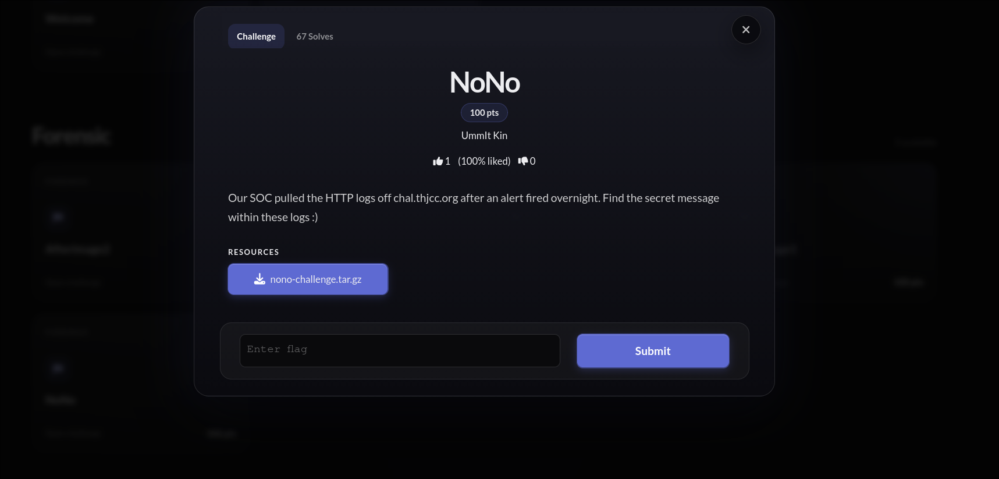

This is a forensics challenge I made for THJCC 2026 Summer, a log-analysis task.

---

## NoNo

> Our SOC pulled the HTTP logs off chal.thjcc.org after an alert fired overnight. Find the secret message within these logs :)



| | |
|---|---|
| **Difficulty** | Easy |
| **Flag** | `THJCC{f0ll0w_th3_str34m_2_th3_h1dd3n_r3p0rt}` |

### The files you get

`nono-challenge.tar.gz` unpacks to four files, three logs and one capture:

| File | Purpose |
|---|---|
| `nginx-access.ndjson` | ECS-format nginx access log, the main surface |
| `portal-app.ndjson` | application-layer log |
| `modsec-waf.ndjson` | ModSecurity WAF log |
| `capture.pcap` | 500-packet HTTP capture, same traffic as the logs, use it to cross-check |

The logs are ndjson, one JSON object per line, so you can throw them into ELK, use
`jq`, or just open them and read. I go with `jq` below.

### Analysis

Almost every request in the logs hits the public vhost `chal.thjcc.org:50000`, with
one exception that hits an internal vhost, `internal.portal`. Count the values of
`url.domain` and that odd request stands right out.

That internal request is `GET /s3cr3t/rep0rt`, returning HTTP 200. `internal.portal`
is an internal vhost you cannot reach from outside, but it is the same box as the
public server, so you keep the path and swap the host for the public domain the
challenge gives you.

### Solution

Count `url.domain` with `jq`, everything is `chal.thjcc.org:50000` except one
`internal.portal`. That one is `GET /s3cr3t/rep0rt`, HTTP 200, from source
`10.0.2.15`, with `url.full: http://internal.portal/s3cr3t/rep0rt`:

```sh
jq -r '.["url.domain"]' nginx-access.ndjson | sort | uniq -c

# Output
    499 chal.thjcc.org:50000
      1 internal.portal

jq -c 'select(.["url.domain"]=="internal.portal")' nginx-access.ndjson

# Output
{"@timestamp":"2025-08-15T03:13:24Z","event.dataset":"nginx.access","source.ip":"10.0.2.15","destination.ip":"172.67.74.226","url.domain":"internal.portal","http.request.method":"GET","url.path":"/s3cr3t/rep0rt","url.original":"/s3cr3t/rep0rt","url.full":"http://internal.portal/s3cr3t/rep0rt","http.response.status_code":200,"http.response.body.bytes":46,"user_agent.original":"Mozilla/5.0","message":"10.0.2.15 - internal.portal \"GET /s3cr3t/rep0rt HTTP/1.1\" 200 46"}
```

If you want to confirm it again in Wireshark, `Follow HTTP Stream` on the request
with `Host: internal.portal` shows the same `GET /s3cr3t/rep0rt`.

Then open that path and you get the flag:

```sh
curl http://chal.thjcc.org:50000/s3cr3t/rep0rt/

# Output
<!DOCTYPE html><html lang="en"><head><meta charset="utf-8"><meta name="viewport" content="width=device-width"><title>Internal Report</title>...</head><body ...><header ...><span class="font-mono text-sm text-neutral-400">internal.portal</span><span class="ml-auto text-xs text-neutral-600 font-mono">INTERNAL REPORT · CONFIDENTIAL</span></header><main ...><div ...><p class="text-xs text-neutral-600 font-mono mb-1">// internal use only</p><h1 ...>Quarterly Access Report</h1><div ...><p class="text-xs text-neutral-500 mb-2">report token</p><code class="text-emerald-400 break-all">THJCC{f0ll0w_th3_str34m_2_th3_h1dd3n_r3p0rt}</code></div></div></main></body></html>
```

If you want it in one line, use `grep`:

```sh
curl -s http://chal.thjcc.org:50000/s3cr3t/rep0rt/ | grep -o "THJCC{[^}]*}"

# Output
THJCC{f0ll0w_th3_str34m_2_th3_h1dd3n_r3p0rt}
```

Flag: `THJCC{f0ll0w_th3_str34m_2_th3_h1dd3n_r3p0rt}`

### Source code

Full challenge source is on my repo:

> [UmmItKin/CTFs-chal · THJCC 2026 Summer/NoNo](https://github.com/UmmItKin/CTFs-chal/tree/master/THJCC%202026%20Summer/NoNo)

The flag page is a plain Astro page that only exists at the leaked path, so there was
nothing to brute-force, you just had to find the path in the logs:

```astro
---
// Hidden flag page — reachable only via the path leaked in capture.pcap.
const FLAG = 'THJCC{f0ll0w_th3_str34m_2_th3_h1dd3n_r3p0rt}'
---

<!-- ... -->
<code class="text-emerald-400 break-all">{FLAG}</code>
```

### Closing thoughts

A simple log-analysis task, which felt about right for THJCC. I was not trying to make
it hard, I just wanted players to get a bit of blue-team analysis practice.
