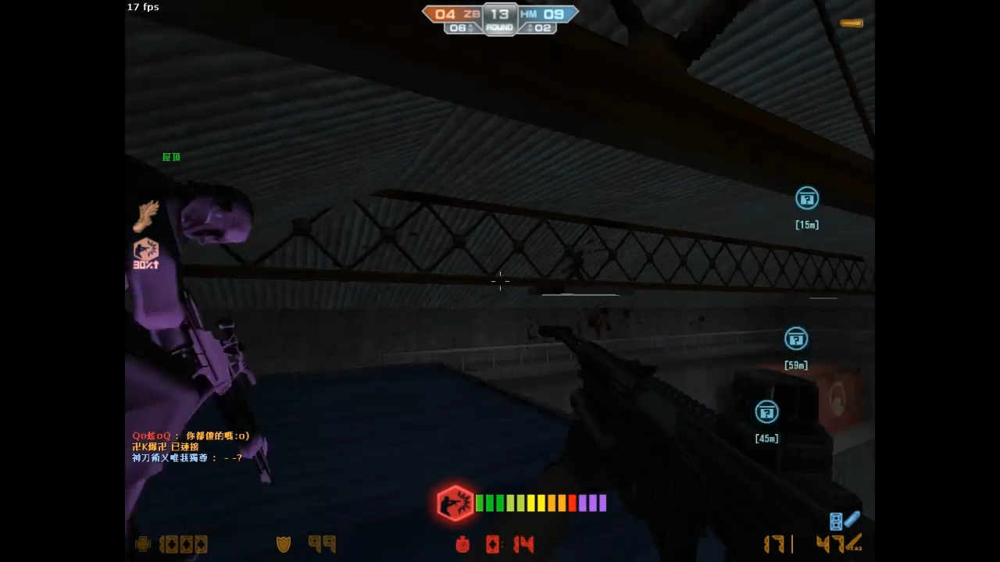
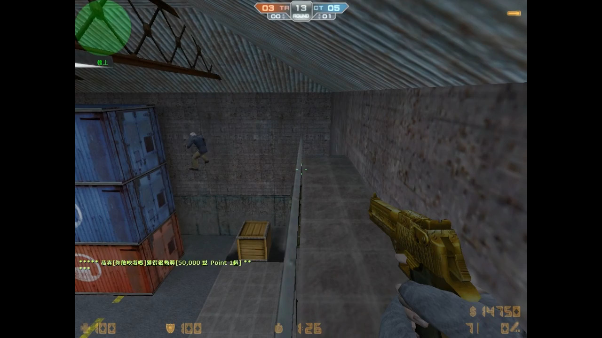

## Counter Strike Online

講起 Counter Strike Online (CSO)，我有半個童年係用左落 CSO 度。個個年代係  Windows XP 年代，仲有就係我第一次用電腦係用緊 XP 機。而第一次接鐲既 game 就係 CSO，另外就係 CS1.6 AVA L4D2 呢幾類槍 game + 喪屍 mode，但今日呢篇文我講 CSO。

曾經既我係好熱愛呢隻 game，我開始玩 CSO 個期係 2008-2009 年左右，印象中只係岩岩出基因藥水，仲係 MG3 時代。然後一玩就玩左幾年。大概係 2008-2011 年。之後走左去玩 1.6。不過雖然咁講，我都係又玩 1.6 又玩 cso 咁過我半個童年。最深刻一定係 CSO, CS1.6。去到後期就啲就已經玩緊 AVA L4D2。

## 細個既天真係最難忘

屍場，即係講緊 cso 既喪屍模式，我仲記得以前係得屍一個陣係好似得幾張圖。以前細個玩真係會勁有 feel，喪屍場個 BGM 真係會嚇撚死你，特別係有時玩緊啲冇乜人既場 eg: (6/32)。個種感覺真係會係兩個 level，係真係會玩到出哂汗同勁緊張。因為當你做緊人同時你係得幾條友，身邊又冇人既時侯，你又得返自已一個做緊人，然後你又唔會知下一秒會唔會冇啦啦彈隻屍出黎殺左你。但係呢種感覺到左我慢慢大大下已經無左了。唔係話隻 Game 變左，係人變左。講真我而加玩 remake RE 真係乜 feel 都冇，何況你話 CSO。細個個陣既代入感一定係最高。因為細個你唔會諗到咁多野。仲有就係你一玩就已經入左隻 game 度。你就好似入面行緊既人類咁，唔知下一秒幾時撞到隻喪屍，然後追撚住你9條街想咬左你再將你變做喪屍。呢種感覺真係一世人可能得細個個陣先有。

### 經典屍場既圖？

有玩過最個陣既 cso 既人一定唔會唔知咩圖。因為個陣既 cso 唔係玩緊呢 張圖就係嗰張圖。

- 倉庫火拼(Assault)
- 迷你戰爭(Rats)
- 鎮壓莊園(Estate)
- 突襲傭兵營(Militia)
- 阿茲特克(Aztec)
- 核武風暴(Nuke)
- 致命大廈(Vertigo)
- 墮落地獄(Abyss)
- 墮落地獄2(Abyss2)
- 墮落地獄3(Abyss3)
- 末日聖地(Union)
- 賭城風雲(Vegas)
- 廢棄工廠(Camouflage2)
- 喋血香港(Dazzling)
- 峽谷突圍(Siege)
- 暗巷衝突(Backalley)
- 義大利巷戰(Italy)-

... 仲有好多張經典圖，不過我個人最鐘意都係玩 Assault。因為我識跳藍箱，講緊係 TR 入面個藍箱。

呀。講埋先，聽住以前既 [CSO Lobby BGM](https://youtube.com/watch?v=FNGd19lP58Y) 咁寫呢篇文令到我更加有以前既 feel。

### 一定俾小學雞踢嘅位

唔知大家有冇對 Assault 呢張圖既感覺係點呢？就我黎講，我係成日俾班小學雞話 F3F3F3。個意思就係喺 cso 入面既投票踢人 System，Chatroom 全頻叫人禁 F3 踢人既意思。不過講係咁講成人俾人踢，即係代表佢冇計殺到我先踢人。以前既 term 黎講就係成班小學雞玩唔起就踢人。

當然啦，以前係講緊一啲年紀好細個既細路仔先叫小學雞，不過而加呢個年代黎講應該係講緊思想行為似個小學生？

Assault 呢張圖，有個位係成個 server 有 9成既人都唔識跳既位，個年講緊只係 2009 2008 年個陣，即係岩岩出基因藥水同埋疾跑個年代。然後如果你想做人有得用疾跑，你係需要用好似係 萬五 Points 去買？ 印象中萬五好似係 30日？ 然後萬五係去買 30 日既法蘭克喪屍，佢係包埋疾跑。之後你仲要課小小金或者你好彩抽到基因藥水。

呢個位係需要練習，仲記得最初我係唔識跳。我係見到有個人上左去呢個位。然後好奇心既我走左去睇下佢下一場會唔會上去。我一望，嘩點解你可以跳得咁遠？之後我好似自已走左去研究定點，發現原來要買基因藥水同埋疾跑先可以跳到。當然啦，以前我識打既中文係好小。其實應該係講緊連中文都唔識打。係識打小小 on9 小學雞用開既英文 only。

印象中我好似係走左佢加佢好友，之後好似係佢陪我練跳藍箱，我好似只係練左半日已經學識左點跳藍箱。仲有就係我識左個 cso 朋友。係之後既日子，一係同佢玩，一係就係自已玩。玩落發現啲人真係好鍾意踢人。所以先出現左呢個 heading。真係一定俾人踢嘅位黎。10個小學雞11個踢 :) 有陣時因為真係踢撚左你，因為講緊陪你玩既人得一個，得佢佢F4係冇用，其他人F3你就會真係入唔返個場。所以講真，個陣時想一齊玩又一齊守藍箱既 round 數真係好小。講緊可能玩左2-3round 已經俾人技票踢緊。踢左之後你  cso 個 fd 又要走埋場。搵個另一個場 =.=

點解踢你？原因好簡單，次次我地都玩到成場得返1-2個人(32/32)，而個1-2個人就係喺藍箱既人。咁你知啦，呢個位要上係需要啲跳既技術。即係 KZ。所以識得跳既人真係超級之咁小。個陣真係好撚正，見到啲人係喺藍箱下面屍企屍，然後上黎殺你。有時侯自已做左屍，個 cso FD 就喺藍箱守緊，你就喺下面望上去真係覺得成座塔咁款。個畫面真係好撚正。

https://youtube.com/watch?v=fau6VDq1u8w

### 識跳藍箱就加到 FD ?

Btw, 個陣因為識上藍箱呢個位，我係呢幾年入面識左唔小都識上藍箱既人。然後我地成班一齊上藍箱守。個 feel 真係好撚正，仲入左應該係全港最大既 KZ 團，做埋副團長。至於係邊個團就唔講 lu，不過佢地好多都係會拍片放 youtube，精華片，技術片，我見有啲直頭係有練開 KZ 跳 block，個個年代黎講跳到 240 版真係已經好 top。

當時 youtube 岩岩 hit 個陣見到佢地啲片，搞到我都想拍下片，不過個陣好細個唔識點整片點拍片。就冇左件事了。喺之後我見到我個團整緊啲宣傳片。又話未來幾日上線就可以參加拍片，不過個陣我係冇參加到 ... 因為要返學 :( 
    
不過反而係有時團練既片佢地擺左上 Youtube 做精華。仲見到自已入左鏡 haha。以前我入既團係玩屍同跳為主，佢地會有時開團練練跳位，就好似 Assault 既藍箱，不過呢張圖反而小，因為入團既人都好熟呢個位點跳 :) 反而練得多既位係 Militia 入面用屍王開 G 跳看板個個位，係老撚咁遠一野跳過黎殺左你，又或者係隔離用屍彈彈自已殺你。

### 第一次收禮物

講起以前，因為基因藥水係要課金抽或者直接買，而因為基因藥水會減你跳個陣既重力，亦即係跳高小小，仲有就係呢個小小既加成就可以影響到好多野。例如TR 藍箱，墮落地獄2 後面入水路，核武風暴跳上水管位，義大利巷戰守位既上面，呢啲位全部都需要你既基因藥水先上到咁滯，所以玩開屍場你唔買真係難搞好多。

而有一日，個陣我係自已玩緊 義大利巷戰，個場好似係滿人。我地成班就係下面守緊，仲要冇位入去，卡住哂係出面，之後我諗到樣野，就係幫所有人搭上去。個位係需要上兩層先上到，而你係需要用基因藥水。但其實我都唔係好記得個陣出左未？定係應該個陣岩岩出屍場？總之係個場我場場就係幫哂所有人上去個個位，之後自已喺下面，咁你知啦，去到咁上下守唔到個陣就仆街了。啲屍入哂黎，退到去得返上面個位守。

因為個個都冇基因藥水既關係卡住哂喺下面，如果有既話，咁啲人應該會企上你個頭了。之後，我就去下面個位，再撳實 Ctrl 再係咁 上下fing 個頭，示意叫人企上我個頭上去。就係咁我幫哂全場既人上去上面。之後啲屍黎到，我就第一個死左了。但其實個陣咁樣幫哂成班人上去個位，係有另一種開心既感覺。

去到完場定隔日？我喺我個個人檔案入面可以收禮物個位度見到，有人送左一日全系列既槍俾我。嘩，我見到之後真係勁撚開心，雖然得一日既所有槍，但係我已經開心左好耐。你見我而加仲寫埋篇文黎講就知我幾難忘。

### 用 Bug 無基因上藍箱

唔知大家有冇見過啲人係空中卡住然後後面條友就跳上佢個頭度再上藍箱？冇錯，呢招其實係叫卡空。當時我見到之後，真係好好奇佢地係點做到，所以就問下佢點整，印象中好似因為咁樣又識左啲 cso fd？定係本身識呢？唔記得了 ...

卡空黎講，原理係視窗化你個 cso，然後你跳落去，再 esc 拎個 mouse 出黎，再將個 mouse 郁去可以拉 windows 個位，當你撳完之後，其他人睇就會見到你係空中唔郁既 status，個個年代啲人叫呢招做 `卡空`。我當時我用呢招幫左唔小人上去藍箱，然後啲人又真係真心廢。上左勁耐都上唔到個頭，然後搞到一齊死哂。仲要俾 cso d fd 屌，做咩幫d 唔識既人上藍箱。我個陣係搞撚到成個場啲人過哂黎藍箱個位 haha ...

不過有個位要注意，就係你只可以 keep 住卡 1分鐘，過左之後你係需要再入過個場，佢會當你 lag 機，之後將你 return 返去 個 room lobby，但其實你可以用呢個方法走場而又唔會扣你 point。

https://youtube.com/watch?v=o4-JJ1jDuJw

### 錄影 Bug

唔知大家有冇用過 cso 既內置錄影功能？，雖然呢個內置功能出哂名多問題，就例如錄完睇返條片男既手會變成女手，但係把 voice 聲係男。又或者你子彈顯示係有 bug，又或者其他唔同既問題。

不過就係因為佢咁撚多 bug 既關係，有人發現可以利用呢個 bug 直接下 round respawn 係你而加個位置，換句話講，如果你上場最後個位係喺藍箱，咁你撳錄影個下同開始下場個下既時間係一樣既話，咁你下  round respawn 既位就唔會返去你下次 random respawn 個位。個情況就係當所有人都去左下一次既 respawn 位置，但係你本人仲係返上場個位置。

#### 點解可以咁做？

錄影個下，其實個人係有一下閃走左，即係個角色會喺呢下既閃變左不存在狀態，而利用呢一下去做一啲本身無可能做到既操作。就例如卡門。實際例子就係，玩緊Assault 呢個場，去左人資房個個位，呢個位正常如果你要卡住係需要由兩個人一上一下咁卡住，但有個問題就係你好大機會俾隻屍用屍彈震開左你地，再入黎殺你地。但係如果係用錄影 bug 卡門呢 ...? 個人就會直接係度門入面，做法只係需要睇準時機，度門一閂個陣就錄影開始，咁你同度門就會合埋左。咁d 屍係點用屍彈震你都唔會震到你。雖一可以破解既方法就係打爆度門再入黎 haha

## 來源

- [【情報】CSO全地圖官方簡介!圖片已增加](https://forum.gamer.com.tw/Co.php?bsn=11902&sn=1885784)